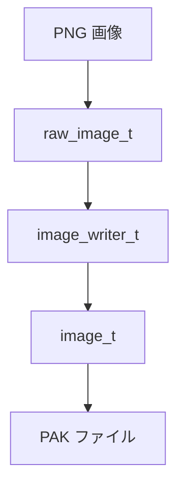

英語分かんないッピ。日本語で回答してね ☆

日本語に訳したドキュメントは `docs` に出力してね。

# ドキュメント作成のルール

## docs 内のルール

docs/README.md がトップページ。

### サブディレクトリ

各ディレクトリには README.md を置き、トップの README.md からリンクを張ること。

## ドキュメント構造

すべての技術ドキュメントは以下の構造に従うこと：

### 必須セクション

1. **# タイトル** - ドキュメントの主題
2. **## 概要** - システム/機能の簡潔な説明（2-3 段落）
3. **## 目的** - 用途と使用目的を箇条書きで列挙
4. **## システムアーキテクチャ** または **## 基本的な使用方法**
   - コンポーネント図や構造の説明
   - 関連ファイルのリスト
5. **メインコンテンツ** - 詳細な技術解説
6. **## 関連ファイル** - ソースコードやドキュメントへのパス
7. **## まとめ** - 要点の再確認と次のステップ

### オプショナルセクション

- **## 参考リンク** - 外部リソースへのリンク
- **## トラブルシューティング** - よくある問題と対処法
- **## デバッグ** - デバッグ方法の説明
- **## 高度なトピック** - 発展的な内容
- **## パフォーマンス** - 最適化やベンチマーク

## マークダウン記法のルール

### 見出し

```markdown
# H1 - ドキュメントタイトル（1 つのみ）

## H2 - メインセクション

### H3 - サブセクション

#### H4 - 詳細項目
```

### コードブロック

言語を必ず指定すること：

````markdown
```cpp
// C++ コード
int main() { return 0; }
```

```bash
# シェルコマンド
makeobj PAK output.pak input.dat
```

```dat
# Dat ファイル
Obj=vehicle
Name=example
```
````

### 表

見やすく整列させること：

```markdown
| カラム 1   | カラム 2   | カラム 3         |
| ---------- | ---------- | ---------------- |
| データ 1   | データ 2   | データ 3         |
| 長いデータ | 短いデータ | 中くらいのデータ |
```

### リスト

- **箇条書き**: `-` を使用
- **番号付き**: `1.` `2.` `3.` を使用
- **ネスト**: 2 スペースでインデント

### 強調

- **太字**: `**重要**` → **重要**
- _斜体_: `*補足*` → _補足_（日本語では控えめに使用）
- `コード`: `` `変数名` `` → `変数名`
- **_太字斜体_**: `***非常に重要***` → **_非常に重要_**（稀に使用）

### 水平線

セクション区切りに使用：

```markdown
---
```

### リンク

```markdown
[テキスト](相対パス.md)
[外部リンク](https://example.com/)
[アンカーリンク](#セクション名)
```

## コード例の書き方

### 実装例

```markdown
#### 実装例

\`\`\`cpp
// コメントで説明を追加
void example_function() {
// 処理の内容
do_something();
}
\`\`\`
```

### コマンド例

```markdown
#### 使用例

\`\`\`bash

# コメントで目的を説明

makeobj PAK output.pak input.dat

# 複数のファイル

makeobj PAK buildings.pak building1.dat building2.dat
\`\`\`
```

### 出力例

```markdown
**出力例**:

\`\`\`
Makeobj version ...
Processing: building1.dat
Image: building1.png (64x64)
Success!
\`\`\`
```

## 絵文字の使用

セクションタイトルや重要なポイントに適度に使用：

- 🚀 入門・クイックスタート
- 📦 ツール・パッケージ
- 🎮 ゲームシステム
- 🔬 詳細な仕様
- 🛠️ 開発ツール
- 📚 ドキュメント
- ⚙️ 設定・オプション
- 🏗️ アーキテクチャ
- 🎯 目的・目標
- 💡 ヒント・Tips
- ⚠️ 注意・警告
- ✅ 完了・成功
- ❌ エラー・失敗
- 🐛 バグ・デバッグ

過度な使用は避け、可読性を優先すること。

## 対象読者の明記

各ドキュメントには「対象読者」セクションを含めること：

```markdown
**対象読者:**

- 初心者向けガイドを読みたい方
- システムの内部構造を理解したい開発者
- 機能を拡張したいコントリビューター
```

## 技術的な表記

### ファイルパス

```markdown
- **相対パス**: `src/simutrans/vehicle.cc`
- **ディレクトリ**: `src/makeobj/` （末尾に `/`）
- **複数ファイル**: `descriptor/writer/image_writer.{h,cc}`
```

### クラスと関数

```markdown
- **クラス名**: `image_writer_t`、`raw_image_t`
- **関数名**: `encode_image()`、`pixrgb_to_pixval()`
- **変数名**: `img_size`、`color_type`
```

### 定数とマクロ

```markdown
- **定数**: `SPECIAL_TRANSPARENT`、`ALPHA_THRESHOLD`
- **マクロ**: `#define SPECIAL (31)`
```

## 図表の作成

### Mermaid 図

複雑な構造は Mermaid 図で表現：

````markdown

````

### ASCII アート

シンプルな構造図：

```markdown
PNG 画像
↓
raw_image_t
↓
image_writer_t
↓
PAK ファイル
```

## 注釈とヒント

### 注意事項

```markdown
**注意**: ファイル名の大文字小文字は Linux/macOS で区別されます。
```

### ヒント

```markdown
**ヒント**: DEBUG モードを使用すると詳細な情報が出力されます。
```

### 警告

```markdown
**警告**: この操作は元に戻せません。バックアップを取ってください。
```

## バージョン情報

機能や API にバージョン依存がある場合は明記：

```markdown
**対応バージョン**: Simutrans 123.0 以降

**変更履歴**:

- v123.0: 新機能追加
- v122.0: パフォーマンス改善
```

## 関連ファイルセクションの形式

```markdown
## 関連ファイル

### カテゴリ 1

- **説明**: `path/to/file.{h,cc}`
- **説明**: `path/to/another.cc`

### カテゴリ 2

- **説明**: `path/to/file.h`
```

## まとめセクションの形式

```markdown
## まとめ

システム名は〜〜という特徴を持っています：

**主な特徴**:

- **特徴 1**: 説明
- **特徴 2**: 説明
- **特徴 3**: 説明

このシステムにより、〜〜を実現しています。

開発者は〜〜を活用して、効率的に〜〜できます。
```

## ドキュメント間のリンク

- 関連するドキュメントは相互リンクを張ること
- README.md に新しいドキュメントを追加したら、必ず索引を更新
- 各ディレクトリの README.md にもリンクを追加

## スタイルガイド

### 文章スタイル

- **です・ます調**: 統一して使用
- **簡潔明瞭**: 冗長な表現を避ける
- **技術用語**: 初出時に説明を加える
- **一貫性**: 同じ概念には同じ用語を使用

### コード品質

- **実行可能**: 掲載するコードは実際に動作するもの
- **完全性**: 省略する場合は `// ...` で明示
- **コメント**: 日本語で説明を追加

### 例示

具体例を豊富に含めること：

```markdown
#### 例 1: 基本的な使用

\`\`\`bash
makeobj PAK output.pak input.dat
\`\`\`

#### 例 2: 複数ファイル

\`\`\`bash
makeobj PAK all.pak \*.dat
\`\`\`
```

## チェックリスト

新しいドキュメントを作成したら以下を確認：

- [ ] タイトルと概要が明確
- [ ] 目的が箇条書きで列挙されている
- [ ] コード例がシンタックスハイライトされている
- [ ] 関連ファイルのパスが記載されている
- [ ] まとめセクションがある
- [ ] README.md からリンクされている
- [ ] 誤字脱字がない
- [ ] マークダウンが正しくレンダリングされる
- [ ] Mermaid 図の構文チェック（`docs` ディレクトリで `npm run lint` を実行）

## ドキュメント編集後の品質チェック

ドキュメントを作成・編集したら、以下のコマンドで品質チェックを実行すること：

```bash
cd docs
npm run lint
```

**チェック内容**:

- Mermaid 図の構文検証
- マークダウンの整合性チェック

**エラーが出た場合**:

1. エラーメッセージを確認
2. Mermaid 図の構文を修正
3. 再度 `npm run lint` を実行して確認
