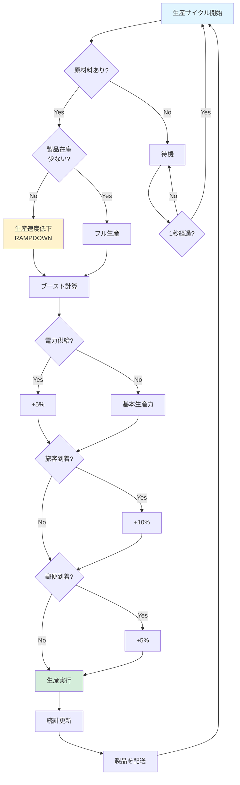
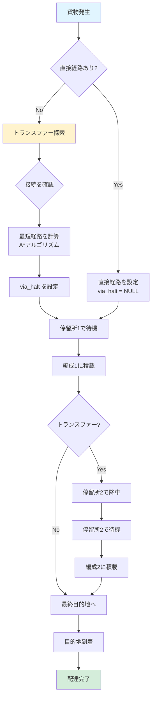
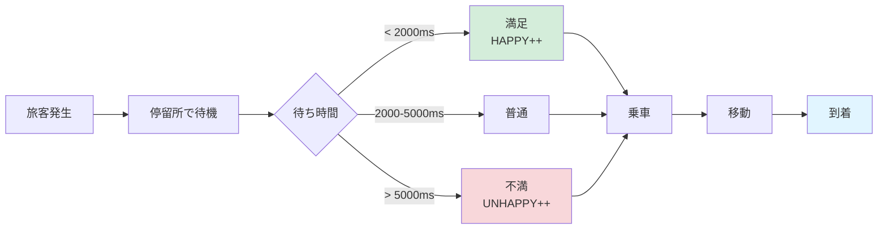
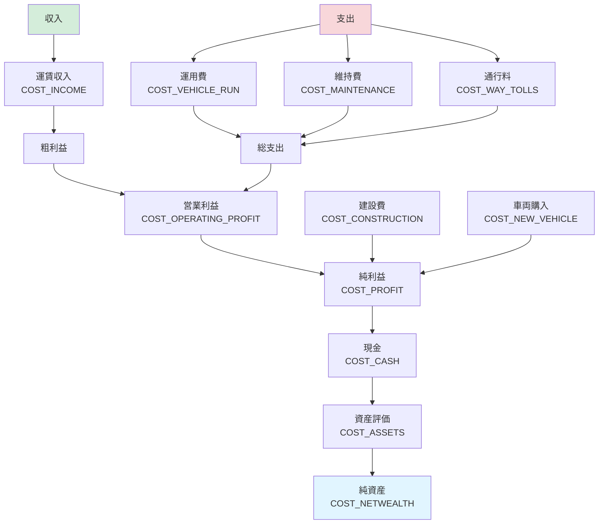
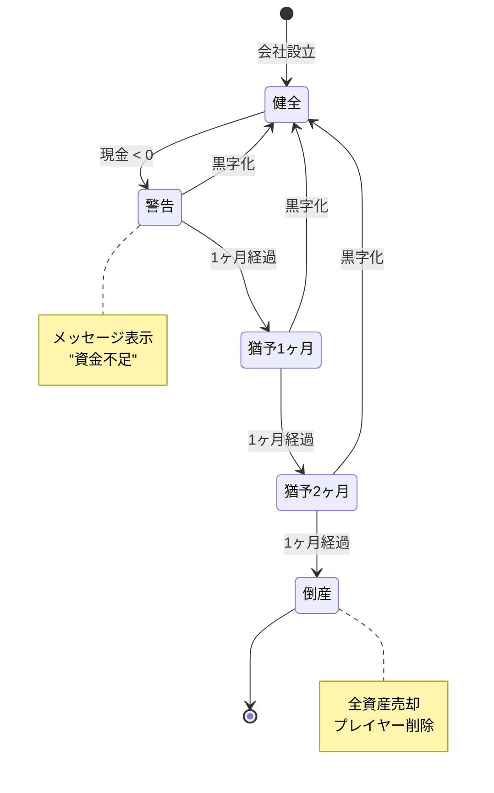
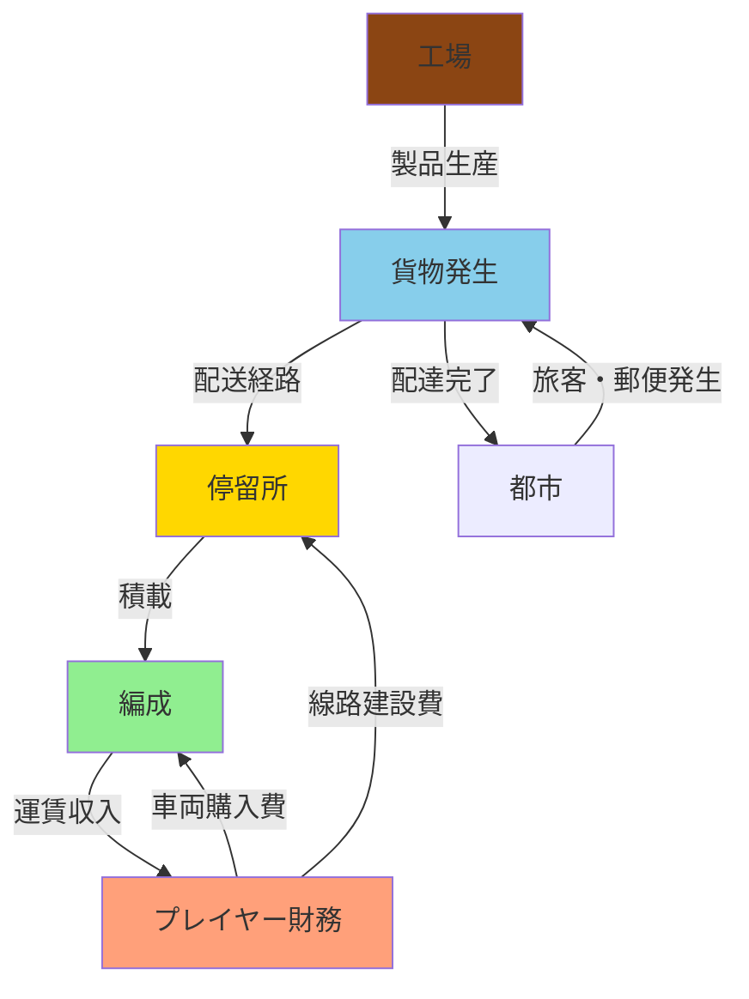

# Simutrans 経済システム（Economy & Logistics）

Simutrans の経済メカニズムとロジスティクスについて解説します。工場による生産、貨物流通、プレイヤーの財務管理が統合的に機能します。

## 📋 構成

- [工場（Factory）システム](#1-工場factoryシステム)
- [貨物（Ware）流通](#2-貨物ware流通システム)
- [プレイヤー財務](#3-プレイヤー財務システム)

---

## 1. 工場（Factory）システム

**ファイル:** [src/simutrans/simfab.h](../../src/simutrans/simfab.h), [simfab.cc](../../src/simutrans/simfab.cc)

### 概要

工場（`fabrik_t`）は、原材料を消費して製品を生産する施設です。サプライチェーンを形成し、経済システムの中核を担います。

### 生産方式

#### Just-In-Time 2 (JIT2)

最新の生産システムで、以下の特徴があります：

- **在庫ベースの生産**: 在庫が一定量を超えると生産速度が低下
- **電力ブースト**: 電力供給で生産性向上
- **旅客ブースト**: 労働者の通勤で生産性向上
- **郵便ブースト**: 郵便配達で生産性向上

```cpp
// ブースト定数
#define FAB_BOOST_ELECTRIC  2  // 電力ブースト
#define FAB_BOOST_PAX       3  // 旅客ブースト
#define FAB_BOOST_MAIL      4  // 郵便ブースト
```

### 生産サイクル



### 工場統計

```cpp
#define FAB_PRODUCTION      0   // 生産量
#define FAB_POWER           1   // 電力消費
#define FAB_BOOST_ELECTRIC  2   // 電力ブースト
#define FAB_BOOST_PAX       3   // 旅客ブースト
#define FAB_BOOST_MAIL      4   // 郵便ブースト
#define FAB_PAX_GENERATED   5   // 発生した旅客
#define FAB_PAX_DEPARTED    6   // 出発した旅客
#define FAB_PAX_ARRIVED     7   // 到着した旅客
#define FAB_MAIL_GENERATED  8   // 発生した郵便
#define FAB_MAIL_DEPARTED   9   // 出発した郵便
#define FAB_MAIL_ARRIVED   10   // 到着した郵便
```

### サプライチェーン

```mermaid
graph LR
    Mine[鉱山<br/>Factory] -->|鉄鉱石| Steel[製鉄所<br/>Factory]
    Coal[炭鉱<br/>Factory] -->|石炭| Steel
    Steel -->|鋼鉄| Car[自動車工場<br/>Factory]
    Car -->|自動車| City[都市<br/>Stadt]

    Forest[森林<br/>Factory] -->|木材| Sawmill[製材所<br/>Factory]
    Sawmill -->|木材| Furniture[家具工場<br/>Factory]
    Furniture -->|家具| City

    style Mine fill:#8B4513
    style Coal fill:#2F4F4F
    style Steel fill:#708090
    style Car fill:#4682B4
    style City fill:#FFD700
```



### 主要メソッド

```cpp
// 生産を実行
void step(uint32 delta_t);

// 原材料を受け取る
void liefere_an(const goods_desc_t* ware, uint32 amount);

// 製品を配送
void distribute_goods(uint32 product_index);

// ブーストを更新
void update_boosts();
```

### 設計のポイント

1. **動的生産**: 需要と供給に応じて生産速度が変化
2. **ブーストシステム**: 電力・旅客・郵便で生産性向上
3. **在庫管理**: 過剰在庫を避けるランプダウン機構
4. **経済連鎖**: 複数工場が連鎖してサプライチェーンを形成

---

## 2. 貨物（Ware）流通システム

**ファイル:** [src/simutrans/simware.h](../../src/simutrans/simware.h), [simware.cc](../../src/simutrans/simware.cc)

### 概要

貨物（`ware_t`）は、輸送される品物の単位です。出発地・目的地・経由地の情報を持ち、経路に沿って移動します。

### 貨物構造

```cpp
class ware_t {
    goods_desc_t* desc;      // 貨物種別
    uint32 amount;            // 数量
    koord target_pos;         // 最終目的地
    koord via_pos;            // 経由地（トランスファー）
    halthandle_t target_halt; // 目的停留所
    halthandle_t via_halt;    // 経由停留所
    uint32 arrival_time;      // 到着予定時刻
};
```

### 貨物カテゴリ

貨物は以下のカテゴリに分類されます：

```cpp
enum goods_catg {
    INDEX_PAS  = 0,  // 旅客（Passengers）
    INDEX_MAIL = 1,  // 郵便（Mail）
    INDEX_NONE = 2,  // 貨物なし
    INDEX_GOODS = 3  // 一般貨物（以降）
};
```

### 経路決定フロー



### トランスファー（乗り換え）

複数の路線を経由して目的地に到達する仕組みです。

**例: 鉱山 → 製鉄所への輸送**


### 待ち時間と不満

旅客は待ち時間に応じて不満を持ちます：

```cpp
// 待ち時間の閾値
#define HAPPY_THRESHOLD    2000  // この時間以内なら満足
#define UNHAPPY_THRESHOLD  5000  // これを超えると不満
```



### 主要メソッド

```cpp
// 目的地を設定
void set_target(koord target_pos);

// 経由地を設定（トランスファー）
void set_via(koord via_pos);

// 到着時刻を記録
void set_arrival_time(uint32 time);

// 貨物を統合（同じ目的地の貨物をまとめる）
void merge(const ware_t &w);
```

### 設計のポイント

1. **トランスファー**: 複雑な輸送網を構築可能
2. **遅延追跡**: 到着時刻を記録し、遅延を可視化
3. **貨物統合**: 同じ目的地の貨物をまとめてメモリ効率化
4. **旅客満足度**: 待ち時間ベースのフィードバック

---

## 3. プレイヤー財務システム

**ファイル:** [src/simutrans/player/simplay.h](../../src/simutrans/player/simplay.h), [finance.h](../../src/simutrans/player/finance.h)

### 概要

各プレイヤーは独立した財務システムを持ち、収入・支出・資産を管理します。

### 財務項目

```cpp
enum finance_t {
    COST_CONSTRUCTION,    // 建設費
    COST_VEHICLE_RUN,     // 車両運用費
    COST_NEW_VEHICLE,     // 車両購入費
    COST_INCOME,          // 収入
    COST_MAINTENANCE,     // 維持費
    COST_ASSETS,          // 資産
    COST_CASH,            // 現金
    COST_NETWEALTH,       // 純資産
    COST_PROFIT,          // 利益
    COST_OPERATING_PROFIT,// 営業利益
    COST_MARGIN,          // 利益率
    COST_TRANSPORTED_GOODS,// 輸送量
    COST_POWERLINES,      // 電線費用
    COST_WAY_TOLLS,       // 通行料
    MAX_PLAYER_COST_BUTTON
};
```

### 財務フロー



### 月次決算

毎月、以下の処理が実行されます：

```cpp
void new_month() {
    // 1. 先月の統計を保存
    roll_finance_history_month();

    // 2. 維持費を計算
    calc_maintenance();

    // 3. 利益率を計算
    calc_margin();

    // 4. 資産評価を更新
    update_assets();

    // 5. AIの場合、戦略を再評価
    if(is_ai()) {
        ai->new_month();
    }
}
```

### 倒産システム

現金がマイナスになると警告が出ます：



### 主要メソッド

```cpp
// 財務統計を記録
void book_stat(sint64 amount, finance_t type);

// 維持費を計算
sint64 calc_maintenance() const;

// 資産評価
sint64 calc_assets() const;

// 倒産チェック
bool check_bankrupt() const;
```

### 設計のポイント

1. **履歴管理**: 12 ヶ月分の履歴を保持し、グラフ表示
2. **自動計算**: 利益率・純資産は自動計算
3. **猶予期間**: 即座に倒産せず、3 ヶ月の猶予
4. **AI 統合**: AI プレイヤーも同じ財務システムを使用

---

## システム統合フロー



このシステム統合により、プレイヤーの投資判断が直接経済に影響を与える深いゲームプレイを実現しています。

---

## クイックリファレンス

| システム    | 責務                     | 主要ファイル         |
| ----------- | ------------------------ | -------------------- |
| **Factory** | 生産、ブースト管理       | simfab.h/cc          |
| **Ware**    | 貨物流通、トランスファー | simware.h/cc         |
| **Finance** | 財務管理、決算処理       | simplay.h, finance.h |

これら 3 つが相互作用して、Simutrans の経済シミュレーションが成立しています。
