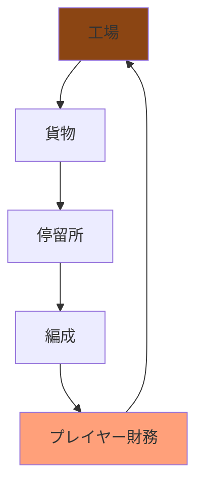
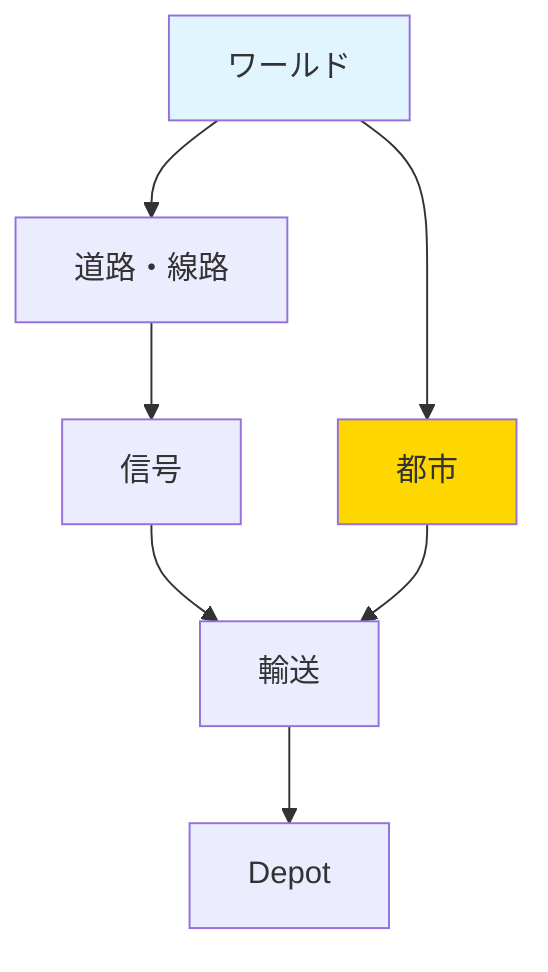
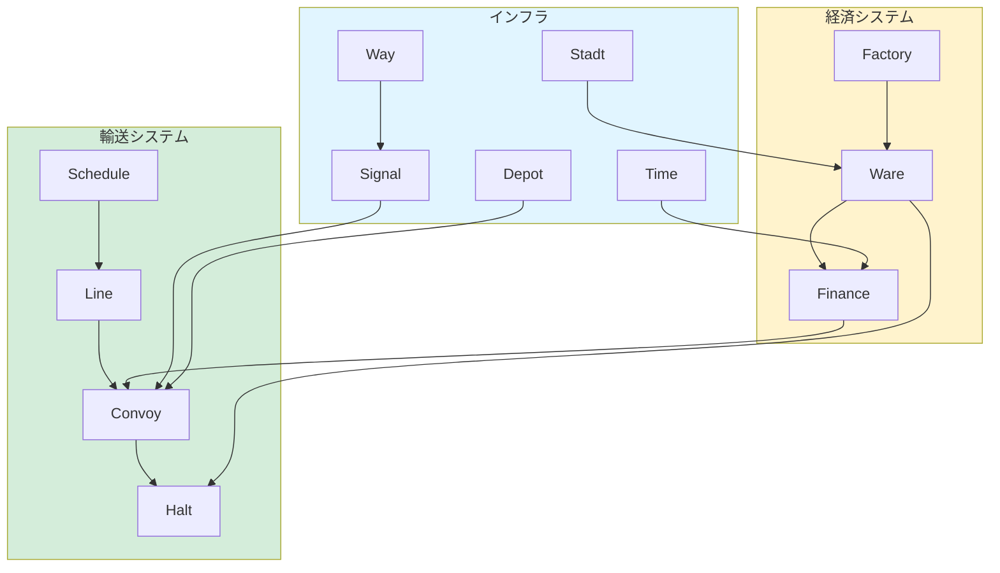

# Simutrans 主要機能リファレンス

## 概要

Simutrans の主要機能は、輸送システム、経済システム、インフラシステムの 3 つの柱で構成されています。各システムは緊密に連携して動作し、リアルな交通シミュレーションを実現しています。

このドキュメントは、個々の機能について実装の詳細と設計思想を詳しく解説しています。ドキュメント量が増えてきたため、3 つの詳細ドキュメントに分割しました。

## 目的

このドキュメントは以下の目的で作成されています:

- **機能別リファレンス**: 各システムの詳細な仕様を提供
- **実装ガイド**: 新機能追加時の参考資料
- **システム連携**: 各機能がどのように相互作用するかを理解
- **トラブルシューティング**: 問題解決のための技術情報

**対象読者:**

- ゲームシステムの詳細を理解したい開発者
- 機能追加や改善を検討している方
- AI 開発やバランス調整に取り組む方

---

## 📚 分割ドキュメント一覧

### 🚉 [TRANSPORT_SYSTEMS.md](TRANSPORT_SYSTEMS.md) - 輸送ネットワークシステム

Simutrans の輸送ネットワークの中核を形成する 4 つのシステムについて解説：

- **停留所（Halt）システム**: 貨物・旅客の積み下ろし拠点、統計管理
- **路線（Line）管理**: 複数編成の統合管理、スケジュール共有
- **編成（Convoi）システム**: 物理シミュレーション、経路探索、貨物管理
- **スケジュール管理**: 巡回経路定義、待機条件管理

---

### 💰 [ECONOMY_SYSTEMS.md](ECONOMY_SYSTEMS.md) - 経済・ロジスティクスシステム

Simutrans の経済メカニズムとサプライチェーンについて解説：

- **工場（Factory）システム**: 原材料消費、JIT2 生産、ブースト管理
- **貨物（Ware）流通**: トランスファー、経路決定、旅客満足度
- **プレイヤー財務**: 収支管理、月次決算、倒産システム

---

### 🏗️ [INFRASTRUCTURE_SYSTEMS.md](INFRASTRUCTURE_SYSTEMS.md) - インフラ・ワールドシステム

Simutrans のゲームワールドの基盤を形成するシステムについて解説：

- **都市（Stadt）システム**: 建物配置、旅客発生、成長メカニズム
- **地形・マップ管理**: タイル構造、オブジェクト管理、グリッド設計
- **時間・同期システム**: ゲーム内カレンダー、月次イベント
- **道路・線路建設**: インフラ建設、アップグレード管理
- **信号・標識システム**: ブロック管理、安全制御
- **Depot（車庫）**: 車両購入・販売、編成管理

---

## 🎯 学習ガイド

### 初心者向け

1. **TRANSPORT_SYSTEMS.md** で基本的な輸送メカニズムを理解
   - Halt → Line → Convoy → Schedule の流れ
2. **ECONOMY_SYSTEMS.md** で経済循環を理解
   - Factory → Ware → Finance の関係
3. **INFRASTRUCTURE_SYSTEMS.md** でワールドを理解
   - Stadt → Way → Signal → Depot の構成

### 中級者向け

各ドキュメントの「設計のポイント」セクションを読むことで、Simutrans の設計哲学を理解できます。

**例: 分散配置による効率化**

- Halt: 複数タイルに配置 → 自動統合
- Stadt: 有機的な拡大 → 自然な都市形成
- Way: グリッドベース → 高速アクセス

### 上級者向け

各セクションの「主要メソッド」と「ソースファイル」を参照し、実装コードを読むことで深い理解が得られます。

---

## 📊 システム相互関係図

**凡例:**

- **輸送システム（緑）**: 貨物・旅客の物理的な輸送
- **経済システム（黄）**: 生産・流通・財務
- **インフラ（青）**: ゲームワールドの基盤

---

## 🔗 クイックナビゲーション

### トピック別

#### 輸送に関する質問

→ [TRANSPORT_SYSTEMS.md](TRANSPORT_SYSTEMS.md)

- "停留所はどのように統合されるのか？"
- "路線スケジュールの仕組みは？"
- "編成の加速計算式は？"

#### 経済に関する質問

→ [ECONOMY_SYSTEMS.md](ECONOMY_SYSTEMS.md)

- "工場の生産をブーストするには？"
- "貨物はどのように配送されるのか？"
- "倒産システムはどう機能するか？"

#### インフラ・ワールドに関する質問

→ [INFRASTRUCTURE_SYSTEMS.md](INFRASTRUCTURE_SYSTEMS.md)

- "都市はどのように成長するのか？"
- "信号とブロック予約の仕組みは？"
- "Depot で何ができるか？"

---

## 📝 各システムの主要ファイル対応表

| ドキュメント           | システム | 主要ファイル         |
| ---------------------- | -------- | -------------------- |
| TRANSPORT_SYSTEMS      | Halt     | simhalt.h/cc         |
|                        | Line     | simline.h/cc         |
|                        | Convoy   | simconvoi.h/cc       |
|                        | Schedule | schedule.h/cc        |
| ECONOMY_SYSTEMS        | Factory  | simfab.h/cc          |
|                        | Ware     | simware.h/cc         |
|                        | Finance  | simplay.h, finance.h |
| INFRASTRUCTURE_SYSTEMS | Stadt    | simcity.h/cc         |
|                        | World    | simworld.h/cc        |
|                        | Way      | weg.h/cc             |
|                        | Signal   | roadsigns_besch.h    |
|                        | Depot    | simdepo.h/cc         |

---

## 関連ファイル

### 輸送システム

- **停留所**: `src/simutrans/simhalt.{h,cc}`
- **路線**: `src/simutrans/simline.{h,cc}`
- **編成**: `src/simutrans/simconvoi.{h,cc}`
- **詳細**: [TRANSPORT_SYSTEMS.md](TRANSPORT_SYSTEMS.md)

### 経済システム

- **工場**: `src/simutrans/simfab.{h,cc}`
- **貨物**: `src/simutrans/simware.{h,cc}`
- **財務**: `src/simutrans/player/finance.{h,cc}`
- **詳細**: [ECONOMY_SYSTEMS.md](ECONOMY_SYSTEMS.md)

### インフラシステム

- **都市**: `src/simutrans/simcity.{h,cc}`
- **道路/線路**: `src/simutrans/boden/wege/`
- **建物**: `src/simutrans/obj/gebaeude.{h,cc}`
- **詳細**: [INFRASTRUCTURE_SYSTEMS.md](INFRASTRUCTURE_SYSTEMS.md)

---

## まとめ

Simutrans の主要機能は、3 つの大きなシステムで構成されています:

**主な特徴**:

- **輸送システム**: 停留所、路線、編成、スケジュールが連携
- **経済システム**: 工場、貨物、財務が Just-in-Time で連携
- **インフラシステム**: 都市、道路、建物が動的に発展
- **相互依存**: 各システムが緊密に連携して動作
- **スケーラビリティ**: 小規模から大規模まで対応

これらのシステムを理解することで、Simutrans の全体像を把握できます。各システムの詳細は、上記の分割ドキュメントを参照してください。

---

## 🚀 次のステップ

各ドキュメントを読む際のポイント：

1. **Mermaid 図を確認** - システムの全体構成を把握
2. **主要メソッド** - インターフェースとシグネチャを理解
3. **設計のポイント** - なぜこのような実装になっているかを理解
4. **ソースコード参照** - 実装の詳細を読む

Happy Learning! 🚂
