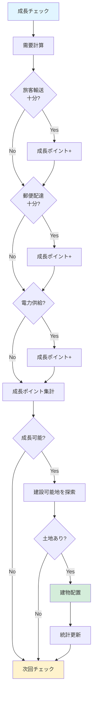
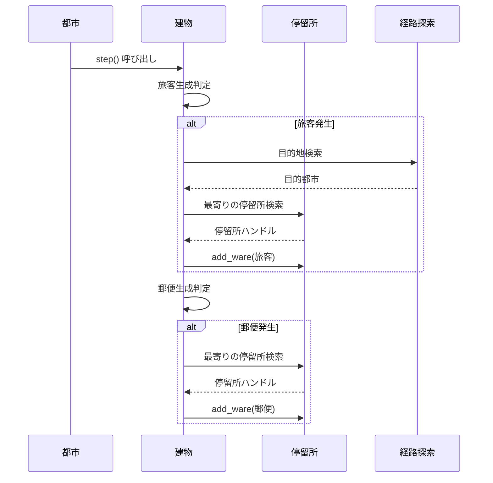
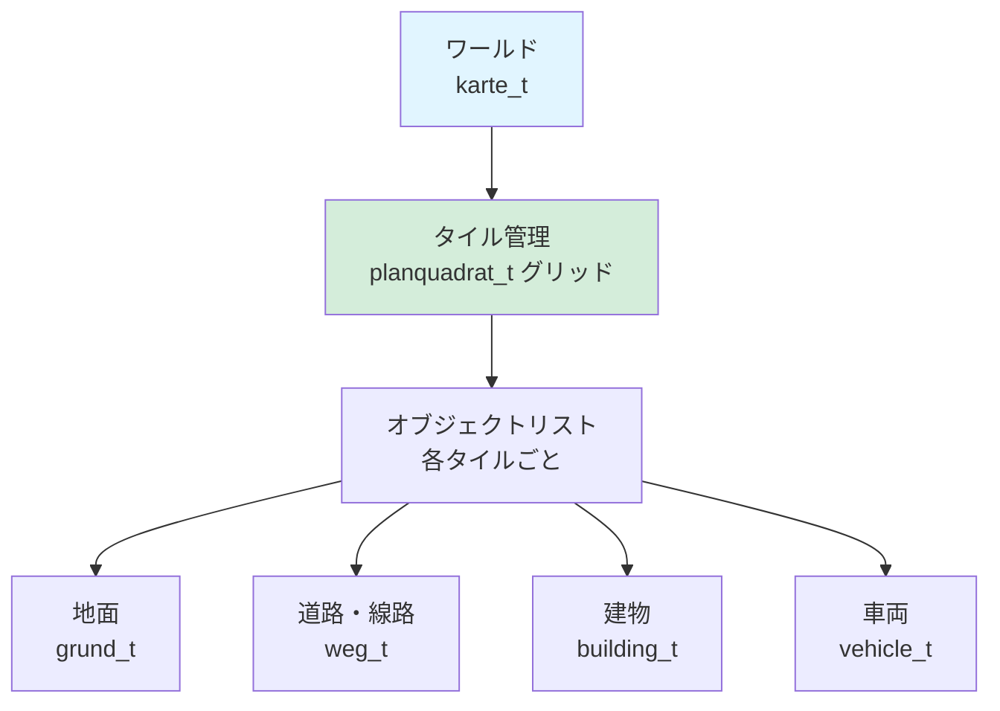
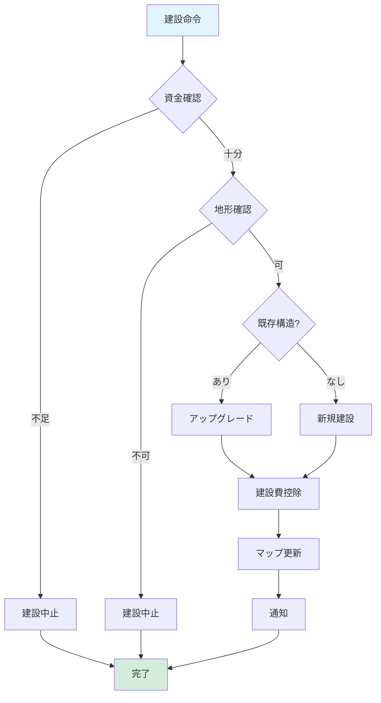
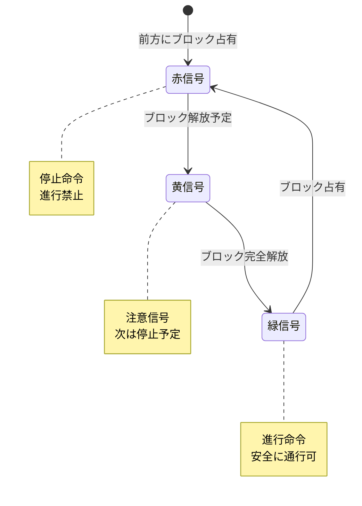
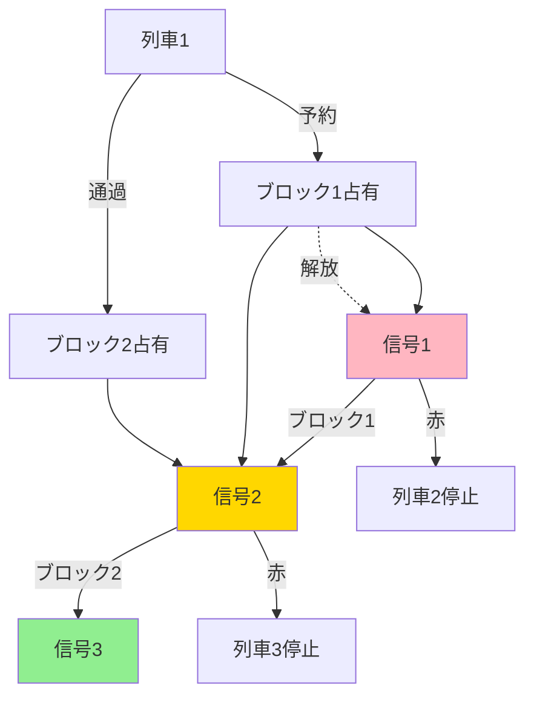
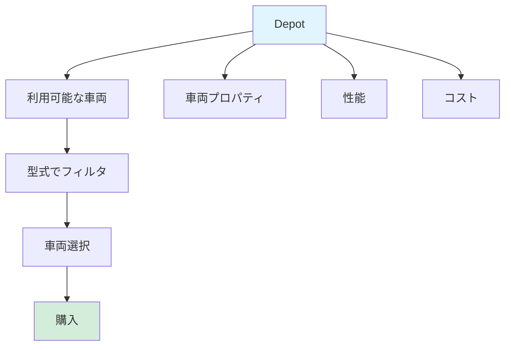
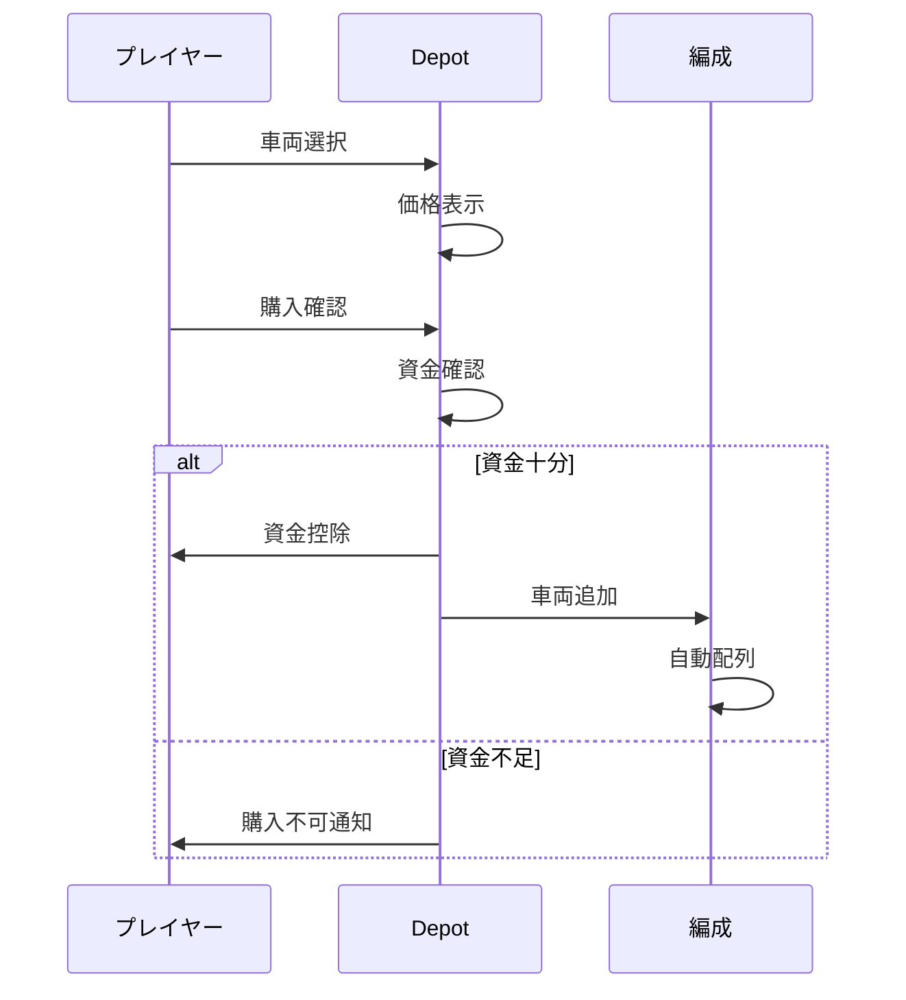
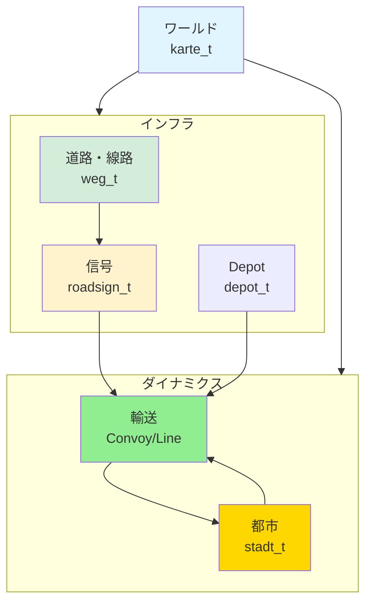

# Simutrans インフラ・ワールドシステム（Infrastructure & World）

Simutrans のワールドインフラと都市システムについて解説します。都市成長、地形管理、建設システムがゲームの基盤を形成します。

## 📋 構成

- [都市（Stadt）システム](#1-都市stadtシステム)
- [地形・マップ管理](#2-地形マップ管理)
- [時間・同期システム](#3-時間同期システム)
- [道路・線路建設システム](#4-道路線路建設システム)
- [信号・標識システム](#5-信号標識システム)
- [Depot（車庫）管理](#6-depot車庫管理)

---

## 1. 都市（Stadt）システム

**ファイル:** [src/simutrans/world/simcity.h](../../src/simutrans/world/simcity.h), [simcity.cc](../../src/simutrans/world/simcity.cc)

### 概要

都市（`stadt_t`）は、建物を配置し、旅客・郵便を発生させ、成長するシステムです。

### 都市成長メカニズム

都市は以下の条件で成長します：

1. **旅客輸送**: 都市間の旅客輸送が活発
2. **郵便配達**: 郵便が配達される
3. **電力供給**: 電力が供給されている（オプション）
4. **道路接続**: 他の都市との道路接続



### 建物タイプ

```cpp
enum building_types {
    residential,  // 住宅
    commercial,   // 商業
    industrial    // 工業
};
```

各建物は旅客・郵便・貨物を発生させます。

### 旅客・郵便生成



### 主要メソッド

```cpp
// 都市の更新（毎ステップ）
void step(uint32 delta_t);

// 成長チェック（毎月）
void new_month();

// 建物を配置
bool build_city_building(koord pos);

// 旅客需要を計算
uint32 get_passenger_demand() const;
```

### 設計のポイント

1. **需要駆動成長**: 輸送サービスの質が成長に直結
2. **有機的拡大**: 道路に沿って自然に拡大
3. **建物多様性**: 住宅・商業・工業のバランス
4. **統計追跡**: 人口・建物数・旅客数を記録

---

## 2. 地形・マップ管理

**ファイル:** [src/simutrans/world/simworld.h](../../src/simutrans/world/simworld.h), [simworld.cc](../../src/simutrans/world/simworld.cc)

### 概要

ワールド（`karte_t`）は、全オブジェクトとマップデータを管理する基本コンテナです。

### マップ構造

```cpp
// タイル座標（3次元）
struct koord3d {
    sint16 x, y;      // 水平座標
    sint8 z;          // 高さ（地形レベル）
};

// グリッド座標
struct koord {
    sint16 x, y;
};
```

### マップレイアウト



### 主要メソッド

```cpp
// タイルを取得
grund_t* lookup(const koord3d &pos) const;

// オブジェクトを追加
bool add_obj(obj_besch_t* besch, const koord3d &pos);

// 高さマップの生成
void create_map(sint32 seed, uint8 industry_density);

// シミュレーションステップ
void step();
```

### 設計のポイント

1. **グリッドベース**: 均一なグリッドで高速アクセス
2. **レイヤー構造**: 各タイルに複数レイヤーのオブジェクト
3. **高さ管理**: 地形の起伏を 3D で表現
4. **メモリ効率**: スパース表現で未使用領域を最小化

---

## 3. 時間・同期システム

**ファイル:** [src/simutrans/simworld.h](../../src/simutrans/world/simworld.h), [simworld.cc](../../src/simutrans/world/simworld.cc)

### 概要

Simutrans の時間システムは、ゲーム内のカレンダーを管理し、月次決算などのイベントをトリガーします。

### 時間管理

```cpp
// ゲーム内時刻
class time_t {
    uint16 year;      // 年
    uint8 month;      // 月（0-11）
    uint8 day;        // 日（0-30）
};

// シミュレーション時間の進行
uint32 simloops;      // シミュレーションループ回数
uint32 total_time;    // 総経過時間（ミリ秒）
```

### 月次イベント処理

```mermaid
sequenceDiagram
    participant Loop as Loop
    participant World as World
    participant Player as Player
    participant Convoy as Convoy
    participant Stadt as Stadt

    Loop->>World: is_new_month()?
    Note over World: Month changed
    World->>Player: new_month()
    Player->>Player: Monthly report
    World->>Convoy: new_month()
    Convoy->>Convoy: Statistics update
    World->>Stadt: new_month()
    Stadt->>Stadt: Growth check
```

### 時間比率

ゲーム速度の調整：

```cpp
// シミュレーション速度の乗数
#define FRAMES_PER_SECOND 20
#define SPEED_MULTIPLIER  1  // 標準速度
                          // 2  // 2倍速
                          // 4  // 4倍速
```

1 ゲーム月は以下の時間で進行します：

- **現実世界**: 約 3 秒（標準速度）
- **ゲーム内**: 1 ヶ月

---

## 4. 道路・線路建設システム

**ファイル:** [src/simutrans/simconst.h](../../src/simutrans/simconst.h), [simconst.cc](../../src/simutrans/simconst.cc)

### 概要

インフラストラクチャ（道路・線路）の構築と管理を行います。

### インフラタイプ

```cpp
enum waytype_t {
    road       = 0,  // 道路
    track      = 1,  // 鉄道
    water      = 2,  // 水路
    air        = 3,  // 航空路
    monorail   = 4,  // モノレール
    tram_track = 5,  // 路面電車
    maglev     = 6,  // リニア
    narrowgauge = 7  // 狭軌鉄道
};
```

### 建設フロー



### 主要メソッド

```cpp
// 道路を建設
bool build_road(const koord3d &pos, way_type_t type);

// 線路を建設
bool build_track(const koord3d &pos, rail_type_t type);

// インフラを削除
bool remove_way(const koord3d &pos);

// コストを計算
sint64 calc_cost(const koord3d &pos, way_type_t type) const;
```

### 設計のポイント

1. **タイプ別管理**: 各ウェイタイプは独立した管理
2. **アップグレード対応**: 既存インフラの改良に対応
3. **コスト管理**: 建設・維持費を正確に記録
4. **接続検証**: 隣接ウェイとの接続確認

---

## 5. 信号・標識システム

**ファイル:** [src/simutrans/bauer/roadsigns_besch.h](../../src/simutrans/bauer/roadsigns_besch.h)

### 概要

信号・標識は、車両の通行制御と安全性確保を行います。

### 信号タイプ

#### 鉄道信号

```cpp
enum signal_type {
    BLOCK_SIGNAL,        // ブロック信号
    CHOOSE_SIGNAL,       // 分岐信号
    PRIORITY_SIGNAL,     // 優先信号
    PRESIGNAL,           // 予告信号
    LONGBLOCK_SIGNAL,    // 長距離ブロック信号
    TWOWAY_SIGNAL        // 双方向信号
};
```

#### 信号状態



### ブロック管理



### 主要メソッド

```cpp
// 信号の状態を更新
void update_state();

// ブロック占有チェック
bool is_block_free(const koord3d &pos) const;

// ブロック予約
bool reserve_block(const koord3d &pos, convoi_t* cnv);
```

### 設計のポイント

1. **ブロック単位管理**: 信号間を「ブロック」として管理
2. **動的予約**: 車両が事前にブロックを予約
3. **衝突回避**: ブロック占有で複数列車の同時通行を防止
4. **予告機構**: 予告信号で減速準備をサポート

---

## 6. Depot（車庫）管理

**ファイル:** [src/simutrans/simdepo.h](../../src/simutrans/simdepo.h), [simdepo.cc](../../src/simutrans/simdepo.cc)

### 概要

Depot は、車両の購入・販売・修繕を行う拠点です。

### Depot の種類

```cpp
enum depot_type {
    BUS_DEPOT,      // バス車庫
    TRUCK_DEPOT,    // トラック車庫
    TRAIN_DEPOT,    // 機関庫
    SHIP_DEPOT,     // 造船所
    AIR_DEPOT,      // 航空基地
    MONORAIL_DEPOT, // モノレール車庫
    TRAM_DEPOT,     // 路面電車車庫
    MAGLEV_DEPOT    // リニア車庫
};
```

### 機能

#### 車両リスト管理



#### 車両購入フロー



### 主要メソッド

```cpp
// 利用可能な車両リストを取得
vector<vehicle_desc_t*> get_available_vehicles() const;

// 車両を購入
bool buy_vehicle(const vehicle_desc_t* desc);

// 車両を販売
bool sell_vehicle(vehicle_t* v);

// 編成を保存
void store_convoy(convoi_t* cnv);
```

### 設計のポイント

1. **車両カタログ**: 利用可能な車両を時代別に提供
2. **価格管理**: 購入価格と販売価格を別管理
3. **自動配列**: 新規購入車両を編成に自動配置
4. **リセット機構**: 編成を Depot に戻すことで解散可能

---

## 全システム統合図



---

## クイックリファレンス

| システム   | 責務                     | 主要ファイル      |
| ---------- | ------------------------ | ----------------- |
| **Stadt**  | 都市成長、需要管理       | simcity.h/cc      |
| **World**  | マップ・オブジェクト管理 | simworld.h/cc     |
| **Way**    | インフラ構造管理         | weg.h/cc          |
| **Signal** | 信号制御、ブロック管理   | roadsigns_besch.h |
| **Depot**  | 車両管理、購入販売       | simdepo.h/cc      |

これらのシステムが連携して、Simutrans のゲームワールドが形成されています。
