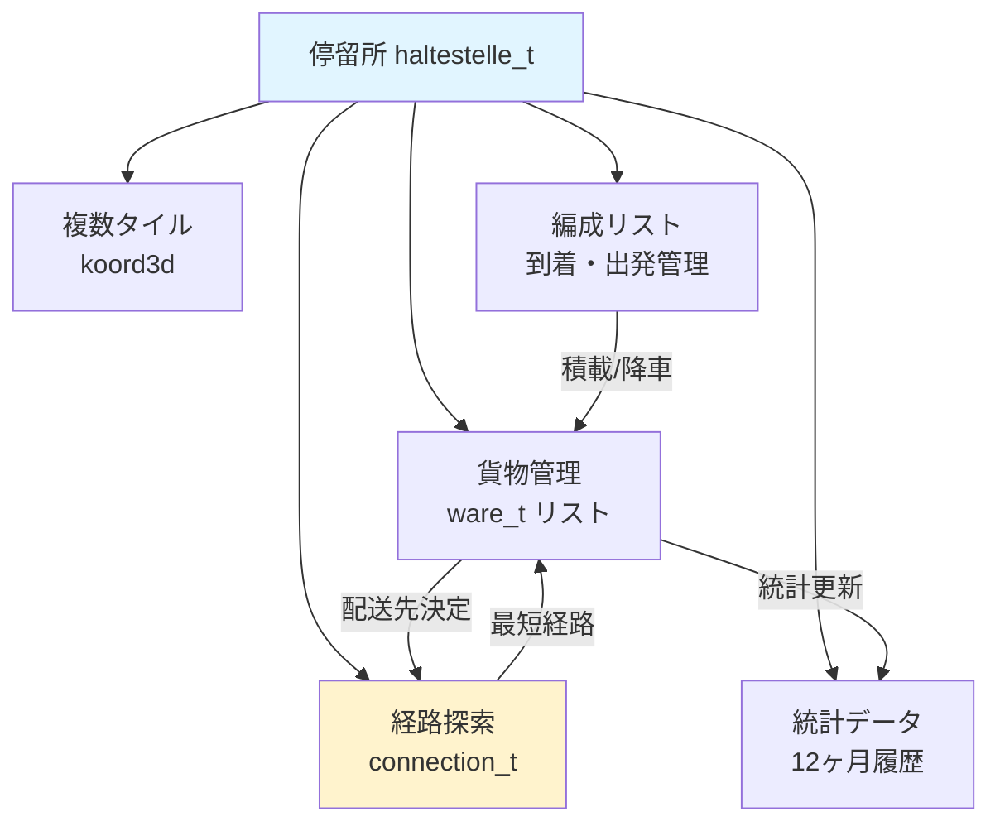
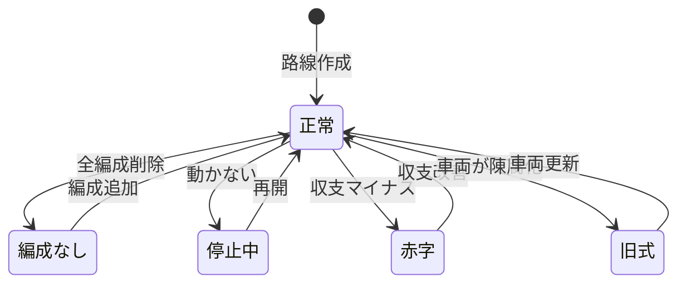
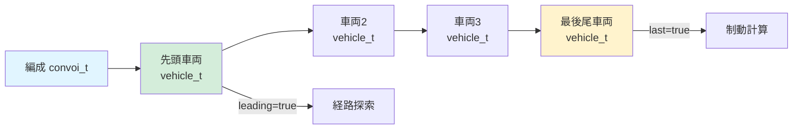
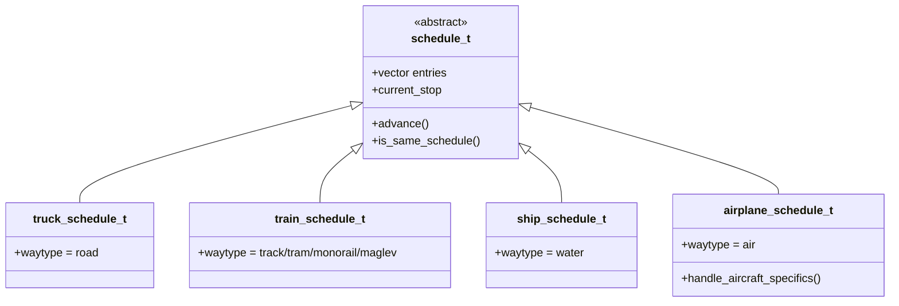
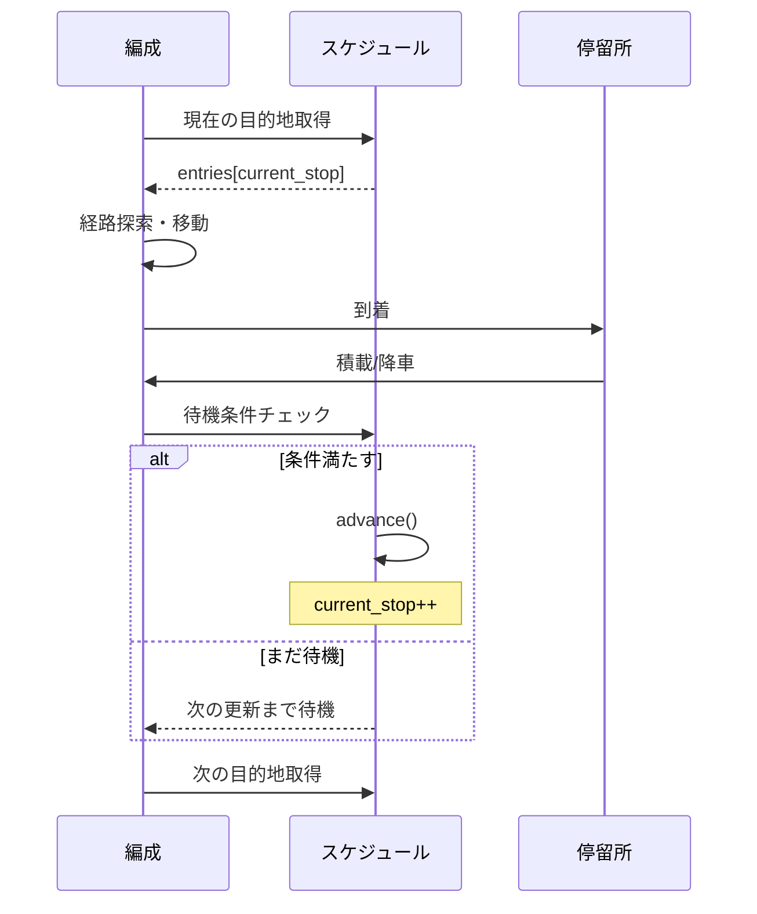
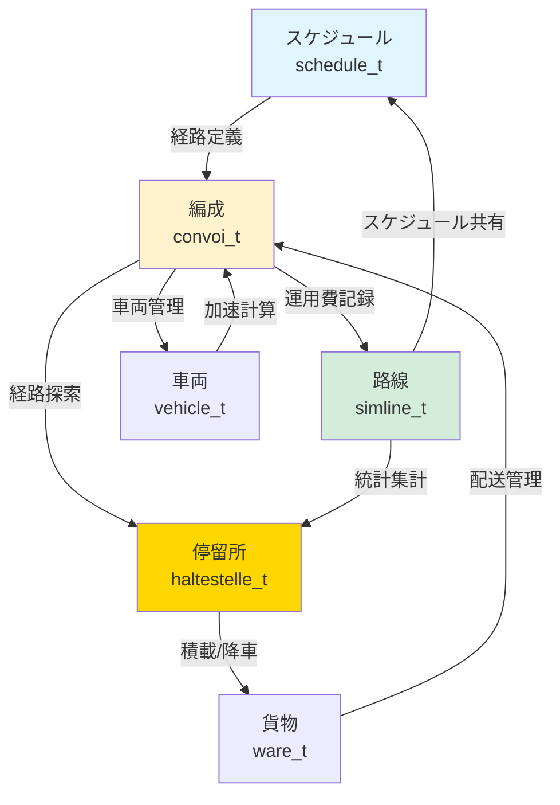

# Simutrans 輸送システム（Transport Networks）

Simutrans の輸送ネットワークを構成する中核システムについて解説します。停留所、路線、編成、スケジュールが相互に連携し、複雑な輸送網を実現しています。

## 📋 構成

- [停留所（Halt）システム](#1-停留所haltシステム)
- [路線（Line）管理](#2-路線line管理システム)
- [編成（Convoi）システム](#3-編成convoiシステム)
- [スケジュール管理](#4-スケジュール管理)

---

## 1. 停留所（Halt）システム

**ファイル:** [src/simutrans/simhalt.h](../../src/simutrans/simhalt.h), [simhalt.cc](../../src/simutrans/simhalt.cc)

### 概要

停留所（`haltestelle_t`）は、Simutrans における貨物・旅客の積み下ろし拠点です。複数のタイルにまたがる停留所を統合管理し、経路探索、貨物配送、統計管理を行います。

### 主要機能

#### 1.1 停留所タイプ

```cpp
enum stationtyp {
    invalid         = 0,
    loadingbay      = 1 << 0,  // トラック荷台
    railstation     = 1 << 1,  // 鉄道駅
    dock            = 1 << 2,  // 港
    busstop         = 1 << 3,  // バス停
    airstop         = 1 << 4,  // 空港
    monorailstop    = 1 << 5,  // モノレール駅
    tramstop        = 1 << 6,  // 路面電車停留所
    maglevstop      = 1 << 7,  // リニア駅
    narrowgaugestop = 1 << 8   // 狭軌鉄道駅
};
```

複数のタイプを組み合わせて（OR 演算）、複合停留所を作成可能です。

#### 1.2 貨物種別の有効化

```cpp
enum station_flags {
    NOT_ENABLED = 0,
    PAX         = 1 << 0,  // 旅客
    POST        = 1 << 1,  // 郵便
    WARE        = 1 << 2   // 貨物
};
```

各停留所は、受け入れる貨物種別を設定できます。

#### 1.3 統計項目

```cpp
#define HALT_ARRIVED         0  // 到着した貨物量
#define HALT_DEPARTED        1  // 出発した貨物量
#define HALT_WAITING         2  // 待機中の貨物量
#define HALT_HAPPY           3  // 満足した旅客数
#define HALT_UNHAPPY         4  // 不満足な旅客数
#define HALT_NOROUTE         5  // 経路なし旅客数
#define HALT_CONVOIS_ARRIVED 6  // 到着した編成数
#define HALT_WALKED          7  // 徒歩で移動した数
```

12 ヶ月分の履歴を保持し、グラフ表示に使用されます。

### アーキテクチャ



### 主要メソッド

#### 貨物管理

```cpp
// 貨物を追加
void add_ware(ware_t ware);

// 貨物を取得（編成への積載）
uint32 fetch_goods(convoihandle_t cnv, slist_tpl<ware_t>& load,
                   const goods_desc_t* good, uint32 amount);

// 待機中の貨物総量
uint32 get_ware_summe(const goods_desc_t* good) const;
```

#### 経路探索

```cpp
// 目的地までの経路を検索
halthandle_t get_halt(const koord &pos, const player_t *player) const;

// 接続情報を更新
void rebuild_destinations();
```

#### 統計

```cpp
// 統計値を記録
void book(sint64 amount, int cost_type);

// 統計値を取得
sint64 get_finance_history(int month, int cost_type) const;
```

### 設計のポイント

1. **分散配置**: 停留所は複数タイルに配置可能で、自動的に統合されます
2. **接続キャッシュ**: 頻繁な経路探索を避けるため、接続情報をキャッシュします
3. **非同期更新**: 経路情報の更新は段階的に行い、パフォーマンスを維持します
4. **予約システム**: 車両が停車位置を予約し、衝突を防ぎます

---

## 2. 路線（Line）管理システム

**ファイル:** [src/simutrans/simline.h](../../src/simutrans/simline.h), [simline.cc](../../src/simutrans/simline.cc)

### 概要

路線（`simline_t`）は、複数の編成を統合管理するシステムです。スケジュールを共有し、統計を集計します。

### 路線タイプ

```cpp
enum linetype {
    line            = 0,  // 汎用
    truckline       = 1,  // トラック
    trainline       = 2,  // 鉄道
    shipline        = 3,  // 船舶
    airline         = 4,  // 航空
    monorailline    = 5,  // モノレール
    tramline        = 6,  // 路面電車
    maglevline      = 7,  // リニア
    narrowgaugeline = 8,  // 狭軌鉄道
    MAX_LINE_TYPE
};
```

### 財務統計

```cpp
#define LINE_CAPACITY          0  // 輸送可能量
#define LINE_TRANSPORTED_GOODS 1  // 輸送済み量
#define LINE_CONVOIS           2  // 編成数
#define LINE_REVENUE           3  // 収入
#define LINE_OPERATIONS        4  // 運用コスト
#define LINE_PROFIT            5  // 利益
#define LINE_DISTANCE          6  // 走行距離
#define LINE_MAXSPEED          7  // 最高速度
#define LINE_WAYTOLL           8  // 通行料
```

### 状態管理

路線の状態は色で表現されます：

- **黒（BLACK）**: 正常
- **白（WHITE）**: 編成なし
- **黄（YELLOW）**: 車両が動いていない
- **赤（RED）**: 先月赤字
- **青（BLUE）**: 旧式車両あり



### 主要メソッド

```cpp
// 編成を路線に追加
void add_convoy(convoihandle_t cnv);

// 編成を路線から削除
void remove_convoy(convoihandle_t cnv);

// スケジュールを設定
void set_schedule(schedule_t* schedule);

// 財務統計を記録
void book(sint64 amount, int cost_type);
```

### 設計のポイント

1. **共有スケジュール**: 複数編成が同じスケジュールを共有し、メモリ効率が向上
2. **集計統計**: 路線全体の統計を自動集計し、経営判断を支援
3. **状態の可視化**: 路線の問題を色で即座に把握可能
4. **撤退モード**: `withdraw` フラグで段階的な路線廃止が可能

---

## 3. 編成（Convoi）システム

**ファイル:** [src/simutrans/simconvoi.h](../../src/simutrans/simconvoi.h), [simconvoi.cc](../../src/simutrans/simconvoi.cc)

### 概要

編成（`convoi_t`）は、複数の車両を連結した輸送単位です。経路探索、加速計算、貨物管理を統合的に行います。

### 編成状態

```cpp
enum states {
    INITIAL,              // 初期状態（車庫内）
    EDIT_SCHEDULE,        // スケジュール編集中
    ROUTING_1,            // 経路探索中
    DUMMY4, DUMMY5,
    NO_ROUTE,             // 経路なし
    CAN_START,            // 出発可能
    CAN_START_ONE_MONTH,  // 1ヶ月後出発可能
    CAN_START_TWO_MONTHS, // 2ヶ月後出発可能
    ENTERING_DEPOT,       // 車庫進入中
    LEAVING_DEPOT,        // 車庫退出中
    DRIVING,              // 運行中
    LOADING,              // 積載中
    WAITING_FOR_CLEARANCE,// 信号待ち
    WAITING_FOR_CLEARANCE_ONE_MONTH,
    WAITING_FOR_CLEARANCE_TWO_MONTHS
};
```

### 編成の構成



### 物理シミュレーション

#### 加速計算

```cpp
void calc_acceleration(uint32 delta_t);
```

以下の要素を考慮します：

- **総重量**: `sum_gesamtweight`（自重 + 積載）
- **摩擦重量**: `sum_friction_weight`（カーブ・勾配による変動）
- **総出力**: `sum_gear_and_power`（ギア補正込み）
- **速度制限**: 線路・信号・カーブによる制約

#### 終端速度計算

```cpp
sint32 calc_max_speed(uint64 total_power, uint64 total_weight, sint32 speed_limit);
```

残余パワー式を使用（詳細は [VEHICLE_TERMINAL_SPEED.md](VEHICLE_TERMINAL_SPEED.md) 参照）

### 主要メソッド

#### 経路管理

```cpp
// 新しい経路を探索
void suche_neue_route();

// スケジュールに従って次の目的地へ
void ziel_erreicht();
```

#### 貨物管理

```cpp
// 停留所で貨物を積載
void laden();

// 貨物を降ろす
void unload_freight();
```

#### 財務

```cpp
// 収入を記録
void book(sint64 amount, int cost_type);

// 運用コストを計算
sint64 calc_running_cost() const;
```

### 設計のポイント

1. **先頭車両の責任**: 経路探索やブロック予約は先頭車両が担当
2. **物理シミュレーション**: 現実的な加速・制動を再現
3. **非同期処理**: 経路探索は非同期で実行し、ゲームループをブロックしない
4. **状態機械**: 明確な状態遷移で複雑な動作を管理

---

## 4. スケジュール管理

**ファイル:** [src/simutrans/dataobj/schedule.h](../../src/simutrans/dataobj/schedule.h), [schedule.cc](../../src/simutrans/dataobj/schedule.cc)

### 概要

スケジュール（`schedule_t`）は、編成の巡回経路を定義します。各エントリーは目的地座標と待機条件を含みます。

### スケジュールエントリー

```cpp
struct schedule_entry_t {
    koord3d pos;           // 目的地座標
    uint8 waiting;         // 待機条件フラグ
    sint16 minimum_loading; // 最小積載率（%）
};
```

### 待機条件フラグ

```cpp
#define WAIT_FOR_TIME      1  // 指定時刻まで待機
#define WAIT_FOR_LOAD     16  // 積載完了まで待機
#define NO_LOAD           32  // 積載しない
```

### スケジュールタイプ



### 実行フロー



### 設計のポイント

1. **循環構造**: スケジュールは循環リストで、最後のエントリーから最初に戻る
2. **柔軟な待機条件**: 時刻・積載率・通過など多様な条件設定
3. **路線との共有**: 同じスケジュールを複数編成で共有可能
4. **動的更新**: 運行中でもスケジュール変更可能（次の停留所から反映）

---

## システム連携図



---

## クイックリファレンス

| システム     | 責務                         | 主要ファイル   |
| ------------ | ---------------------------- | -------------- |
| **Halt**     | 貨物集約、経路探索、統計     | simhalt.h/cc   |
| **Line**     | スケジュール共有、集計統計   | simline.h/cc   |
| **Convoi**   | 物理演算、経路探索、貨物管理 | simconvoi.h/cc |
| **Schedule** | 経路定義、待機条件管理       | schedule.h/cc  |

これら 4 つのシステムが緊密に連携することで、Simutrans の複雑な輸送ネットワークが実現されています。
