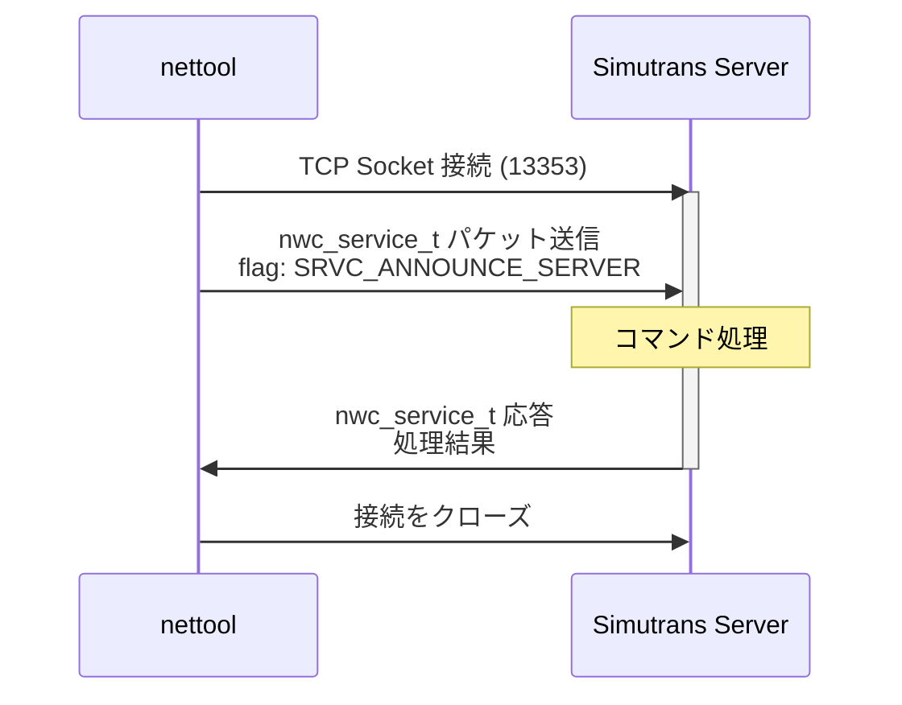
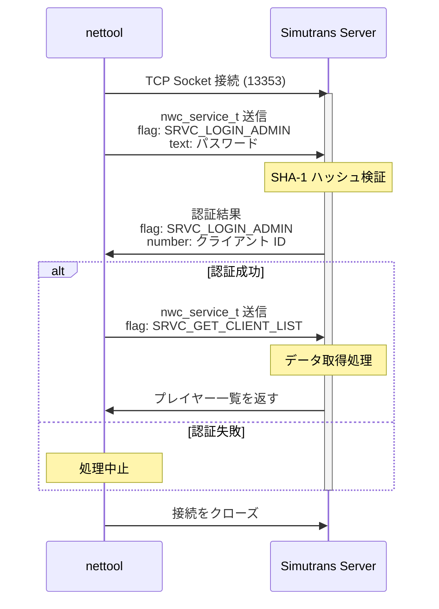
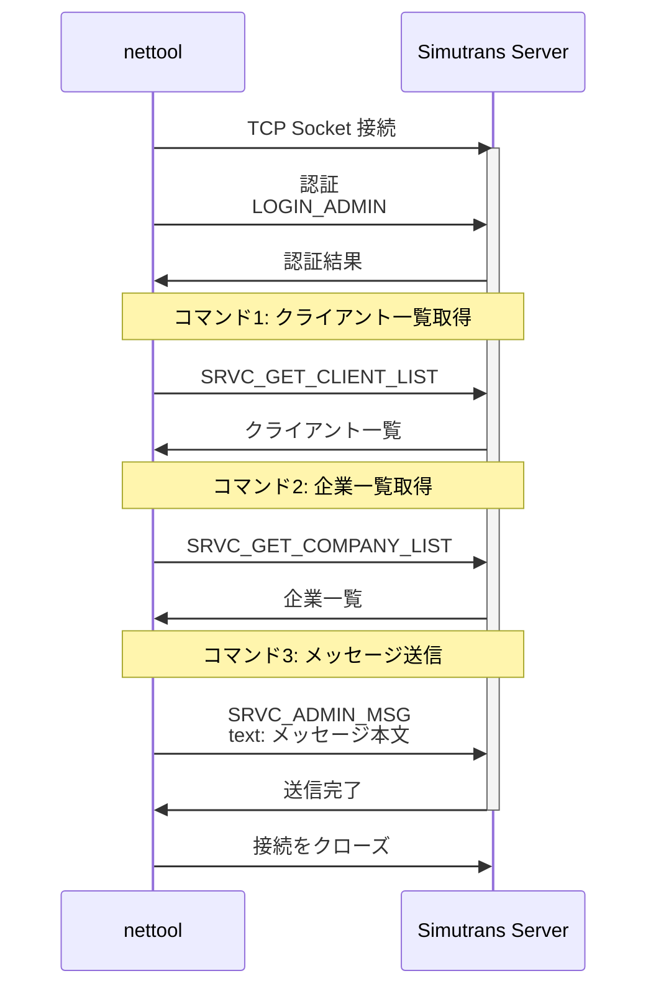
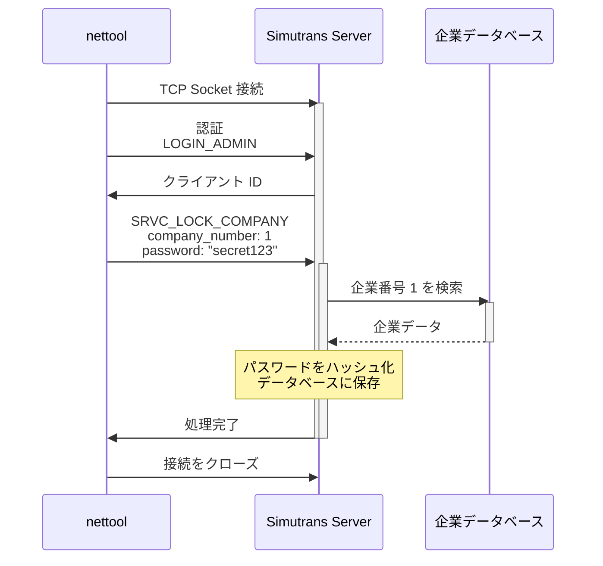
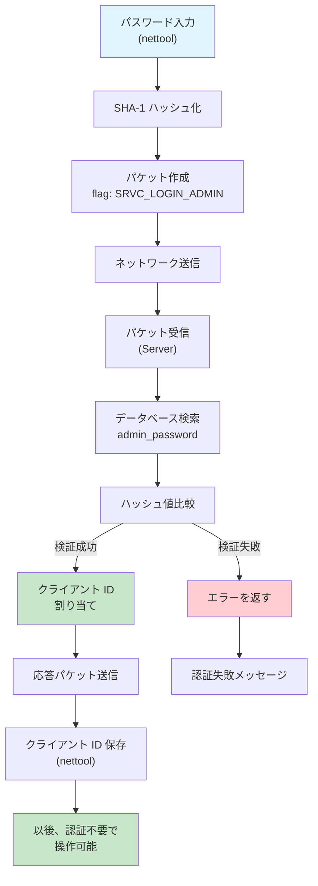
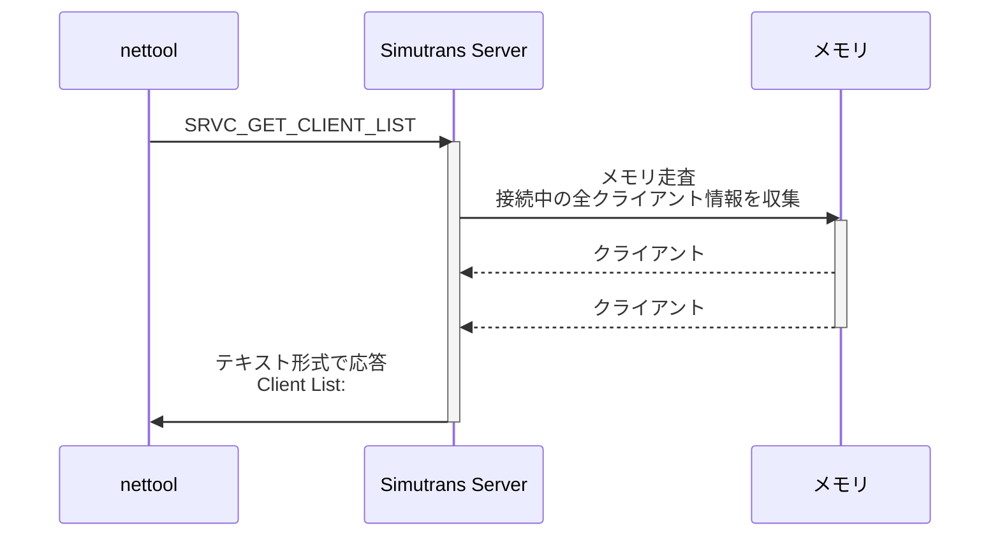
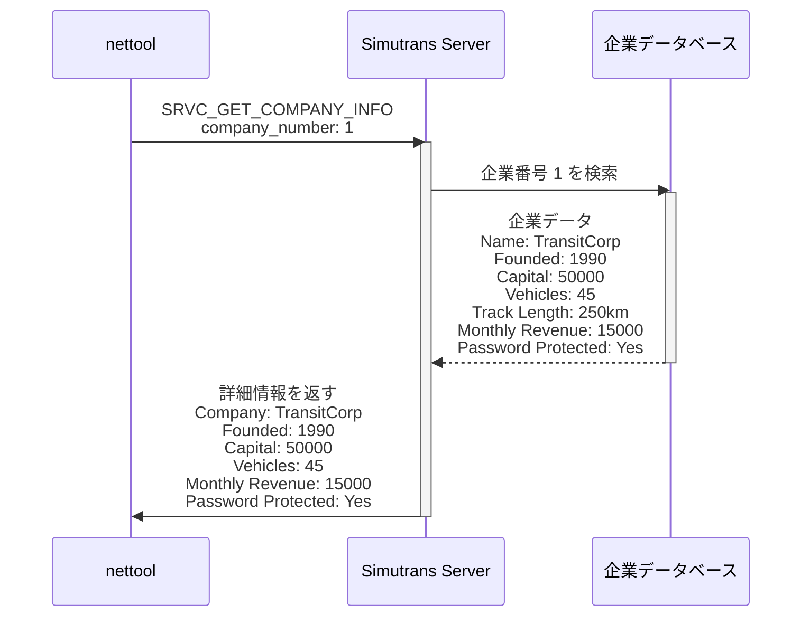
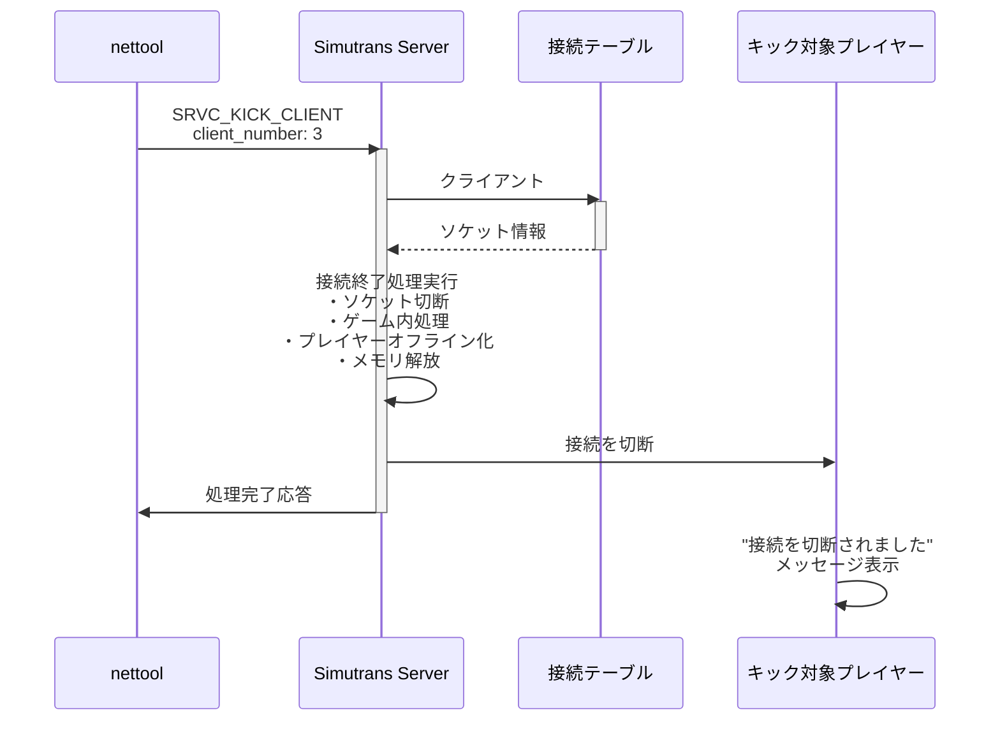
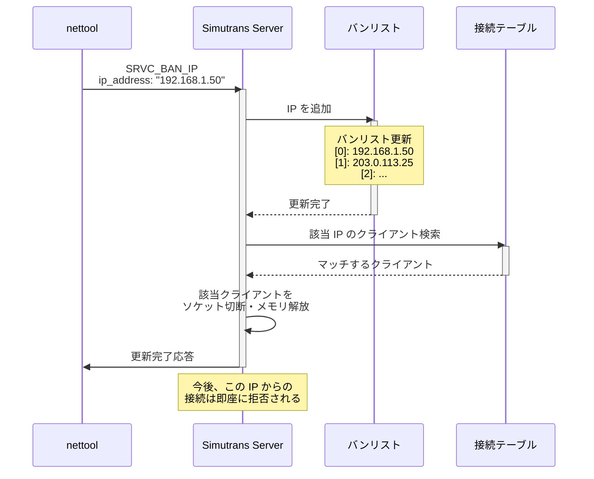
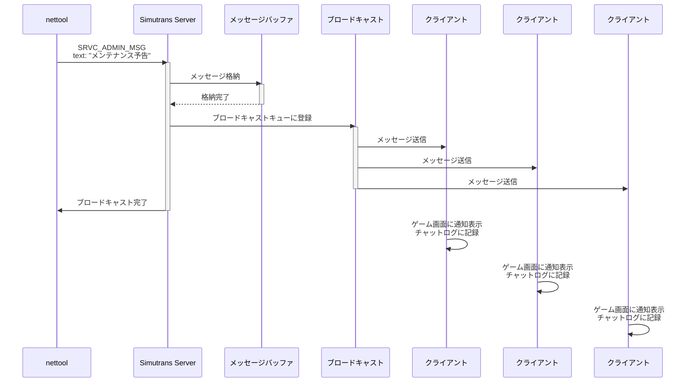

# Nettool - Simutrans ネットワークサーバー制御ツール

## 概要

**nettool** は、Simutrans マルチプレイヤーサーバーをコマンドラインから管理・制御するためのユーティリティツールです。サーバーの管理者が、実行中のサーバーに対して様々な操作や設定変更を行えます。

## 目的

nettool は、以下のような用途で使用されます：

- **サーバー管理**: サーバーの稼働状況確認、シャットダウン
- **クライアント管理**: 接続中のプレイヤーの確認、キック、IP アドレスのバン
- **会社（企業）管理**: ゲーム内の企業のロック/アンロック、情報確認、削除
- **サーバー公開**: セントラルリストサーバーへの公開申請
- **管理メッセージ送信**: 全プレイヤーへの通知メッセージ配信
- **ゲーム状態制御**: サーバーの同期強制、シャットダウン

## インストールと起動

### ビルド

Simutrans のビルドシステムの一部として自動的にビルドされます：

```bash
# CMake を使用する場合
cmake -B build
cmake --build build --target nettool

# Make を使用する場合
make nettool
```

ビルド成功後、実行ファイルは以下の場所に配置されます：

- Linux/macOS: `build/nettool`
- Windows: `build/nettool.exe`

## 基本的な使用方法

### 一般的なコマンド形式

```bash
nettool [オプション] <コマンド> [コマンド引数]
```

### オプション

| オプション           | 説明                                             | 例                     |
| -------------------- | ------------------------------------------------ | ---------------------- |
| `-s <server[:port]>` | 接続するサーバーを指定                           | `-s example.com:13353` |
| `-p <password>`      | 管理パスワードをコマンドラインで指定             | `-p mypassword`        |
| `-P <filename>`      | パスワードをファイルから読み込み（`-` で stdin） | `-P password.txt`      |
| `-q`                 | クワイエットモード（著作権メッセージを非表示）   | `-q`                   |
| `-h`                 | ヘルプを表示                                     | `-h`                   |

### デフォルト設定

- **サーバーアドレス**: `localhost:13353`（ローカルホスト）
- **ポート**: `13353`（デフォルト Simutrans サーバーポート）

### パスワード入力方法

認証が必要なコマンド（ほとんどのコマンド）では、以下の優先順で パスワード を指定します：

1. **コマンドラインで指定** (`-p` オプション)
2. **ファイルから読み込み** (`-P` オプション)
3. **対話的に入力** (プロンプトが表示される)

例：

```bash
# 対話的に入力（パスワードはエコーされない）
nettool -s myserver.com clients

# コマンドラインで直接指定
nettool -s myserver.com -p mypassword clients

# ファイルから読み込み
nettool -s myserver.com -P /etc/simutrans/admin_password.txt clients

# stdin から読み込み
echo "mypassword" | nettool -s myserver.com -P - clients
```

## 利用可能なコマンド

### サーバー情報・管理コマンド

#### 1. `announce`

**説明**: セントラルリストサーバーへサーバーを公開（アナウンス）するよう要求します。

**認証**: 不要（パスワード不要）

**使用例**:

```bash
nettool -q announce
```

**戻り値**:

- `0`: 成功
- `1`: サーバーに接続できない
- `2`: サーバーへのメッセージ送信失敗
- `3`: その他のエラー

---

#### 2. `shutdown`

**説明**: サーバーをシャットダウンします。

**認証**: 必要（管理パスワード）

**使用例**:

```bash
nettool -s gameserver.com shutdown
# または
nettool -s gameserver.com -p adminpass shutdown
```

**警告**: このコマンドはサーバーを即座に終了させます。すべてのプレイヤーが接続を失います。

---

#### 3. `force-sync`

**説明**: サーバーに同期コマンドの送信を強制します。ゲームの保存とリロードを行わせます。

**認証**: 必要（管理パスワード）

**用途**: デシンク（同期ずれ）の検出・修正、ゲーム状態の確認・安定化

**使用例**:

```bash
nettool -s gameserver.com -p adminpass force-sync
```

---

### クライアント管理コマンド

#### 4. `clients`

**説明**: サーバーに接続しているプレイヤー（クライアント）の一覧を表示します。

**認証**: 必要（管理パスワード）

**出力情報**:

- クライアント番号
- プレイヤー名
- IP アドレス
- ポート番号
- 接続状態
- その他のクライアント情報

**使用例**:

```bash
nettool -s gameserver.com clients
```

**出力例**:

```
Client List from server:
Client #1: PlayerName1 (192.168.1.100:12345)
Client #2: PlayerName2 (192.168.1.101:12346)
...
```

---

#### 5. `kick-client <client_number>`

**説明**: 指定したクライアント番号のプレイヤーをサーバーからキックします。

**認証**: 必要（管理パスワード）

**パラメータ**:

- `<client_number>`: キック対象のクライアント番号（`clients` コマンドで確認）

**使用例**:

```bash
nettool -s gameserver.com -p adminpass kick-client 3
```

**動作**:

- プレイヤーは接続を切断されます
- ゲーム内の企業・資産は影響を受けません
- 同じプレイヤーは再度接続可能です

---

#### 6. `ban-client <client_number>`

**説明**: 指定したクライアント（プレイヤー）を IP アドレスベースでバンします。

**認証**: 必要（管理パスワード）

**パラメータ**:

- `<client_number>`: バン対象のクライアント番号

**使用例**:

```bash
nettool -s gameserver.com -p adminpass ban-client 5
```

**動作**:

- クライアントのクライアント番号をバンリストに追加
- そのクライアント番号の IP アドレスからの接続を拒否
- 既存の接続は切断されます

---

### IP アドレス管理コマンド

#### 7. `ban-ip <ip_address>`

**説明**: 指定した IP アドレスをバンします。

**認証**: 必要（管理パスワード）

**パラメータ**:

- `<ip_address>`: バンする IP アドレス（例: `192.168.1.100`）

**使用例**:

```bash
nettool -s gameserver.com -p adminpass ban-ip 192.168.1.100
```

**動作**:

- その IP アドレスからの全ての接続を拒否
- すでに接続されている場合は切断
- `blacklist` コマンドで確認可能

---

#### 8. `unban-ip <ip_address>`

**説明**: IP アドレスのバンを解除します。

**認証**: 必要（管理パスワード）

**パラメータ**:

- `<ip_address>`: アンバンする IP アドレス

**使用例**:

```bash
nettool -s gameserver.com -p adminpass unban-ip 192.168.1.100
```

---

#### 9. `blacklist`

**説明**: 現在バンされている IP アドレス一覧を表示します。

**認証**: 必要（管理パスワード）

**使用例**:

```bash
nettool -s gameserver.com blacklist
```

**出力例**:

```
Banned IP addresses:
192.168.1.50
192.168.1.100
203.0.113.25
...
```

---

### 企業（会社）管理コマンド

#### 10. `companies`

**説明**: サーバーで実行中の全企業（会社）の一覧を表示します。

**認証**: 必要（管理パスワード）

**出力情報**:

- 企業番号
- 企業名
- オーナー（プレイヤー名）
- 設立年
- 資本金
- 企業資産情報（車両、インフラなど）

**使用例**:

```bash
nettool -s gameserver.com companies
```

---

#### 11. `info-company <company_number>`

**説明**: 特定の企業の詳細情報を表示します。

**認証**: 必要（管理パスワード）

**パラメータ**:

- `<company_number>`: 情報を表示する企業番号（`companies` コマンドで確認）

**使用例**:

```bash
nettool -s gameserver.com info-company 2
```

**出力情報**:

- 企業名
- 設立日・年
- 現在の資本金
- 月間収益
- 保有車両数
- インフラ資産（線路、道路、橋など）
- パスワード保護状態

---

#### 12. `lock-company <company_number> <new_password>`

**説明**: 企業にパスワードを設定して、ロック（保護）します。

**認証**: 必要（管理パスワード）

**パラメータ**:

- `<company_number>`: ロック対象の企業番号
- `<new_password>`: 設定するパスワード

**使用例**:

```bash
nettool -s gameserver.com -p adminpass lock-company 1 "secret123"
```

**ファイルからパスワード読み込み**:

```bash
# テキストファイルからパスワード読み込み
nettool -s gameserver.com -p adminpass lock-company 1 -F password.txt

# stdin からパスワード読み込み
echo "secret123" | nettool -s gameserver.com -p adminpass lock-company 1 -F -
```

**動作**:

- 指定した企業をパスワード保護
- 他のプレイヤーがこの企業にアクセスするには、正しいパスワードが必要
- 企業の所有者でも、異なるプレイヤーがアクセスするときはパスワード入力が必要

---

#### 13. `unlock-company <company_number>`

**説明**: 企業のパスワード保護を解除します。

**認証**: 必要（管理パスワード）

**パラメータ**:

- `<company_number>`: アンロック対象の企業番号

**使用例**:

```bash
nettool -s gameserver.com -p adminpass unlock-company 1
```

**動作**:

- 企業のパスワード保護が解除される
- 誰もが自由にアクセス可能になる

---

#### 14. `remove-company <company_number>`

**説明**: 企業と全ての関連資産を完全に削除します。

**認証**: 必要（管理パスワード）

**パラメータ**:

- `<company_number>`: 削除対象の企業番号

**使用例**:

```bash
nettool -s gameserver.com -p adminpass remove-company 1
```

**警告**: このコマンドは**取り返しがつきません**。以下の内容が全て削除されます：

- 企業の全車両
- 企業の全インフラ（線路、道路、駅など）
- 企業の全資産と資金
- 企業に関連する全データ

**推奨**: 実行前に企業の情報をバックアップしておくことをお勧めします。

---

### メッセージング コマンド

#### 15. `say <message>`

**説明**: 全プレイヤーへ管理者メッセージを送信します。

**認証**: 必要（管理パスワード）

**パラメータ**:

- `<message>`: 送信するメッセージ（最大 512 文字）

**使用例**:

```bash
nettool -s gameserver.com -p adminpass say "サーバーメンテナンスのため、1時間後にシャットダウンします"

nettool -s gameserver.com -p adminpass say "新バージョンがリリースされました。更新してください。"
```

**動作**:

- メッセージが全接続中のプレイヤーに表示される
- ゲーム画面上に画面通知として表示される
- チャットウィンドウにも記録される

---

## 戻り値（リターンコード）

nettool は、コマンド実行後に以下のいずれかの終了コードを返します：

| コード | 説明                                                                 |
| ------ | -------------------------------------------------------------------- |
| `0`    | **成功**: コマンドが正常に実行されました                             |
| `1`    | **接続エラー**: サーバーに接続できませんでした                       |
| `2`    | **送信エラー**: サーバーへのメッセージ送信に失敗しました             |
| `3`    | **その他のエラー**: 認証失敗、パラメータエラー、コマンド実行失敗など |

**スクリプトでの使用例**:

```bash
#!/bin/bash

nettool -s gameserver.com -p adminpass companies > companies_list.txt
if [ $? -eq 0 ]; then
    echo "企業一覧の取得に成功しました"
else
    echo "エラーが発生しました（終了コード: $?）"
fi
```

---

## 実用的な使用例

### 例 1: 通常の管理タスク

```bash
# 接続中のプレイヤー一覧を確認
nettool -s gameserver.com -P admin_pass.txt clients

# 問題のあるプレイヤーをキック
nettool -s gameserver.com -P admin_pass.txt kick-client 3

# グローバルメッセージを送信
nettool -s gameserver.com -P admin_pass.txt say "こんにちは。サーバーの調整を行います"

# サーバーの同期を確認
nettool -s gameserver.com -P admin_pass.txt force-sync
```

### 例 2: 企業保護

```bash
# VIP プレイヤーの企業を保護
nettool -s gameserver.com -p adminpass lock-company 5 "vip_company_pass"

# 情報を確認
nettool -s gameserver.com -p adminpass info-company 5
```

### 例 3: セキュリティ管理（自動スクリプト）

```bash
#!/bin/bash

ADMIN_PASS="mypassword"
SERVER="gameserver.com"

# 不正なプレイヤーを検出・バン
BANNED_IPS=("192.168.1.50" "203.0.113.25")

for ip in "${BANNED_IPS[@]}"; do
    echo "Banning IP: $ip"
    nettool -s $SERVER -p $ADMIN_PASS ban-ip $ip
done

# バンリストを確認
echo "Current blacklist:"
nettool -s $SERVER -p $ADMIN_PASS blacklist
```

### 例 4: 定期メンテナンス

```bash
#!/bin/bash

ADMIN_PASS="mypassword"
SERVER="gameserver.com"

# メンテナンス予告
nettool -s $SERVER -p $ADMIN_PASS say "【予告】本サーバーは明日午前2時よりメンテナンスを行います"

# 数分後、スケジュール変更の通知
sleep 300
nettool -s $SERVER -p $ADMIN_PASS say "【重要】メンテナンスを午前3時に変更いたしました"

# 最終通知
sleep 600
nettool -s $SERVER -p $ADMIN_PASS say "【最終通知】あと30分でシャットダウンします。接続をお切りください"

sleep 1800
# シャットダウン実行
nettool -s $SERVER -p $ADMIN_PASS shutdown
```

---

## セキュリティに関する注意事項

### パスワード管理

1. **コマンドラインでのパスワード指定は避ける**

   - シェル履歴に残る可能性がある
   - 代わりにファイルや stdin から読み込む

   ```bash
   # 非推奨
   nettool -s server.com -p password123 clients

   # 推奨
   nettool -s server.com -P /etc/simutrans/admin_pass.txt clients
   ```

2. **パスワードファイルのパーミッション管理**

   ```bash
   # ファイルの所有者のみがアクセス可能に
   chmod 600 /etc/simutrans/admin_pass.txt
   chown root:root /etc/simutrans/admin_pass.txt
   ```

3. **SSH トンネル経由の接続**

   - リモートサーバーにアクセスする場合は SSH トンネルを使用

   ```bash
   # SSH トンネルを確立
   ssh -L 13353:localhost:13353 admin@gameserver.com

   # ローカルホスト経由でアクセス
   nettool -s localhost:13353 -P password.txt clients
   ```

### ローカルホストのみでの実行

デフォルトではローカルホストからのアクセスのみが許可されます：

```bash
nettool clients  # localhost:13353 に接続
```

---

## トラブルシューティング

### "Could not connect to server" エラー

**原因**: サーバーが起動していないか、アドレス/ポートが間違っている

**解決策**:

```bash
# アドレスとポートを確認
nettool -s correct.server.com:13353 clients

# ポート番号がデフォルトでない場合は明示的に指定
nettool -s gameserver.com:14000 clients
```

### "Authentication failed" / "Wrong password" エラー

**原因**: パスワードが間違っているか、ファイルの読み込み失敗

**解決策**:

```bash
# パスワードを対話的に入力して確認
nettool -s gameserver.com clients
# プロンプトが表示されるので、パスワードを入力

# ファイルが正しく読み込まれているか確認
cat /etc/simutrans/admin_pass.txt
```

### "Could not send message to server" エラー

**原因**: ネットワーク接続の問題、サーバーがビジー状態

**解決策**:

1. ネットワーク接続を確認
2. サーバーのログを確認
3. しばらく待機してから再度試行

---

## nettool の通信メカニズム

### 全体的な流れ

nettool と Simutrans サーバーは、**ネットワークソケット通信**を使用してコマンドと応答をやり取りしています。以下のシーケンス図は、基本的な通信パターンを示しています。

### 📡 TCP/IP ソケット通信について（重要）

**重要な点**: nettool は **HTTP 通信ではなく、TCP ソケット通信**を使用しています。

#### TCP vs HTTP の違い

| 項目                   | TCP                           | HTTP                                |
| ---------------------- | ----------------------------- | ----------------------------------- |
| **プロトコル層**       | トランスポート層（L4）        | アプリケーション層（L7）            |
| **通信方式**           | ストリーム型（バイト流）      | リクエスト/レスポンス型             |
| **通信フォーマット**   | バイナリ/独自形式             | テキスト形式                        |
| **接続方式**           | 3-way handshake で確立        | HTTP/1.1 なら Keep-Alive 対応       |
| **ステート管理**       | ステートフル（接続を維持）    | ステートレス（デフォルト）          |
| **接続オーバーヘッド** | 接続確立に ~100ms             | 毎リクエスト接続確立                |
| **通信効率**           | 高速・低オーバーヘッド        | ヘッダで 200+バイトのオーバーヘッド |
| **実装難易度**         | 単純なソケット操作            | HTTP ライブラリが必要               |
| **使用例**             | SSH, FTP, ゲーム通信, nettool | Web ブラウザ, REST API              |

#### なぜ nettool は TCP を使うのか？

**メリット:**

1. **低レイテンシー**

   - TCP 接続を一度確立すれば、複数コマンドを遅延なく送受信
   - HTTP では毎リクエスト接続確立に ~100ms の遅延が生じる可能性

2. **バイナリ効率**

   - Simutrans 独自パケット形式（`nwc_service_t`）をそのまま送受信
   - HTTP なら、バイナリを Base64 エンコード化して送信 → デコード（約 33%のオーバーヘッド）

3. **ステートフル通信**

   - 認証後、同一接続で複数コマンド実行可能
   - HTTP では毎リクエスト認証情報を送信する必要がある

4. **リアルタイム性**

   - サーバーの状態をリアルタイムに反映
   - 複数コマンド実行時の一貫性を保証

5. **低オーバーヘッド**
   - TCP ヘッダ: 20-60 バイト
   - HTTP ヘッダ: 200+ バイト（毎リクエスト）

**デメリット:**

- REST API ほど標準的ではない（独自プロトコル）
- ブラウザから直接アクセス不可
- ファイアウォール経由で通信が複雑になる場合がある

#### ネットワークレイヤーの図

```
┌─────────────────────────────────────────────────┐
│ アプリケーション層 (L7)                         │
│  HTTP, HTTPS, FTP, DNS, Telnet, SSH, ...      │
│  ✓ REST API, Web サービス                     │
├─────────────────────────────────────────────────┤
│ トランスポート層 (L4)  ← nettool はここ        │
│  TCP, UDP, SCTP, ...                          │
│  ✓ nettool は TCP を使用                      │
├─────────────────────────────────────────────────┤
│ インターネット層 (L3)                          │
│  IP (IPv4, IPv6)                              │
├─────────────────────────────────────────────────┤
│ リンク層 (L2)                                   │
│  イーサネット、WiFi、PPP、...                  │
└─────────────────────────────────────────────────┘
```

#### ネットワーク通信パケットの構成

```
┌──────────────────────────────────────────────────────────┐
│ TCP/IP パケット（ネットワーク上を流れるデータ）          │
│                                                          │
│ ┌─ IP ヘッダ（20 バイト最小）                           │
│ │  • 送信元 IP: 192.168.1.100                          │
│ │  • 宛先 IP: gameserver.com (203.0.113.1)            │
│ │  • プロトコル: TCP (6)                               │
│ │  • TTL, フラグメント ID, etc.                        │
│ │                                                      │
│ ├─ TCP ヘッダ（20-60 バイト）                          │
│ │  • 送信元ポート: 54321 (クライアント側が割り当て)    │
│ │  • 宛先ポート: 13353 (Simutrans server port)        │
│ │  • シーケンス番号、確認応答番号                      │
│ │  • フラグ: SYN(接続開始), ACK(確認), FIN(接続終了) │
│ │  • ウィンドウサイズ、チェックサム                    │
│ │                                                      │
│ └─ ペイロード（Simutrans パケット）                    │
│    • nwc_service_t 構造体                            │
│    • Packet ID, Version, Command flag, Data         │
└──────────────────────────────────────────────────────────┘
```

#### HTTP 通信との比較例

**TCP (nettool) で "clients" コマンド実行:**

```
1. TCP 3-way handshake        ~50ms
2. nwc_service_t 送信          <1ms  (バイナリ: 約50-100 バイト)
3. 応答受信                     <1ms  (バイナリ: 約200-500 バイト)
4. 接続クローズ                 ~1ms
─────────────────────────────────────
総所要時間: 約 50-60ms
```

**HTTP で同じコマンド実行：**

```
1. TCP 3-way handshake        ~50ms
2. HTTP GET リクエスト送信      <1ms  (テキスト: ~300-500 バイト)
3. HTTP レスポンス受信          <1ms  (テキスト: ~500-1000 バイト)
4. 接続クローズ                 ~1ms
5. HTTP リクエスト再送信        <1ms  (次のコマンドなら、また3-way handshake)
─────────────────────────────────────
総所要時間: 約 50-60ms (単一コマンド)
複数コマンドなら: 各コマンドで ~50ms 追加
```

#### 結論

- **nettool（TCP）**: 低レイテンシー、効率的、複数コマンド向け
- **HTTP**: Web サービス向け、ブラウザアクセス可能、広く知られている

Simutrans のように、**リアルタイムゲーム**で複数の管理コマンドを頻繁に実行する場合は、TCP の方が適切です。

### シーケンス 1: 認証が不要なコマンド（例: announce）



**処理フロー:**

1. **ソケット接続**: TCP でサーバーの 13353 ポートに接続
2. **コマンド送信**: `nwc_service_t` パケットを送信
3. **サーバー処理**: サーバーがコマンドを実行
4. **応答受信**: 処理結果をパケットで受信
5. **接続クローズ**: ソケットを切断

---

### シーケンス 2: 認証が必要なコマンド（例: clients）



**処理フロー:**

1. **接続確立**: TCP でサーバーに接続
2. **認証リクエスト**: パスワード付きの LOGIN_ADMIN コマンドを送信
3. **パスワード検証**: サーバーが SHA-1 ハッシュで検証
4. **認証結果の受信**: クライアント ID を含む応答を受信
5. **実コマンド送信**: 認証成功後、実際のコマンド（例：`SRVC_GET_CLIENT_LIST`）を送信
6. **データ受信**: サーバーから応答データを受信
7. **接続クローズ**: ソケットを切断

---

### シーケンス 3: 複数コマンドの連続実行



**最適化:**

- 同一接続上で複数のコマンドを実行可能
- 毎回の接続/認証処理を削減し、効率化
- スクリプト内での複数操作時に有効

---

### シーケンス 4: パスワード保護企業の操作（lock-company）



**データフロー:**

1. nettool が企業番号と新パスワードを送信
2. サーバーが企業データベースを検索
3. パスワードをハッシュ化して保存
4. 次回からこの企業へのアクセスには認証が必要に

---

### パケット構造の詳細

#### `nwc_service_t` パケット

```
┌─────────────────────────────────────────────┐
│  パケットヘッダ (Simutrans標準)             │
│  - パケット ID (NWC_SERVICE)               │
│  - バージョン情報                          │
│  - チェックサム                            │
└─────────────────────────────────────────────┘
         ↓
┌─────────────────────────────────────────────┐
│  nwc_service_t ペイロード                  │
│                                            │
│  flag (uint32)                            │
│  ├─ SRVC_LOGIN_ADMIN                     │
│  ├─ SRVC_GET_CLIENT_LIST                 │
│  ├─ SRVC_KICK_CLIENT                     │
│  └─ ...（その他のコマンド）               │
│                                            │
│  text (char*)      ← テキストデータ       │
│  ├─ パスワード                            │
│  ├─ メッセージ本文                        │
│  └─ IP アドレス                          │
│                                            │
│  number (uint32)   ← 数値パラメータ       │
│  ├─ クライアント ID                       │
│  ├─ 企業番号                              │
│  └─ ポート番号                            │
│                                            │
└─────────────────────────────────────────────┘
```

#### 認証フローの詳細



---

### 情報取得の仕組み

#### 例 1: クライアント一覧の取得（clients コマンド）



#### 例 2: 企業情報の取得（info-company コマンド）



---

### 操作実行の仕組み

#### 例 1: クライアントのキック（kick-client コマンド）



#### 例 2: IP アドレスのバン（ban-ip コマンド）



#### 例 3: 全プレイヤーへのメッセージ送信（say コマンド）



---

## nettool の内部実装

### アーキテクチャ

nettool は以下の特徴を持つスタンドアロンアプリケーションです：

- **シンプルな設計**: Simutrans の完全なゲームエンジンを必要とせず
- **ネットワーク通信**: Simutrans の標準ネットワークプロトコルを使用
- **マルチプラットフォーム**: Windows、Linux、macOS で動作
- **軽量**: 低リソース環境でも実行可能

### ネットワークプロトコル

nettool は `nwc_service_t` コマンドクラスを使用してサーバーと通信します：

```cpp
// nettool.cc での通信例
nwc_service_t nwcs;
nwcs.flag = nwc_service_t::SRVC_GET_CLIENT_LIST;  // コマンドを指定
nwcs.send(socket);  // サーバーへ送信

// サーバーからの応答を受信
nwc_service_t *response = (nwc_service_t*)network_receive_command(NWC_SERVICE);
```

### 認証メカニズム

認証が必要なコマンドでは：

1. `SRVC_LOGIN_ADMIN` フラグでパスワードを送信
2. サーバーが SHA-1 ハッシュで検証
3. 成功時はクライアント ID が割り当てられる

---

## ビルドとコンパイル

### 依存関係

- C++11 以上をサポートするコンパイラ
- POSIX 系 OS（Linux, macOS）または Windows
- Simutrans ネットワークライブラリ

### CMake でのビルド

```bash
cd /path/to/simutrans
cmake -B build
cmake --build build --target nettool
```

### 手動でのコンパイル例（Linux）

```bash
g++ -std=c++11 -o nettool \
    src/nettool/nettool.cc \
    src/simutrans/network/network.cc \
    src/simutrans/network/network_cmd.cc \
    src/simutrans/utils/simstring.cc \
    -I src/ -lpthread
```

---

## 関連リソース

- **ネットワークコマンド定義**: [src/simutrans/network/network_cmd.h](../src/simutrans/network/network_cmd.h)
- **ネットワークサービスコマンド**: [src/simutrans/network/network_cmd_ingame.h](../src/simutrans/network/network_cmd_ingame.h)
- **メインソースコード**: [src/nettool/nettool.cc](../src/nettool/nettool.cc)

---

## ライセンス

nettool は Artistic License の下で公開されています。詳細は [LICENSE.txt](../LICENSE.txt) を参照してください。

---

## まとめ

nettool は Simutrans マルチプレイヤーサーバーの**強力で柔軟な管理ツール**です：

✅ **主な機能**:

- クライアント・IP アドレス管理
- 企業（会社）管理とパスワード保護
- グローバルメッセージング
- サーバー同期・シャットダウン制御

✅ **利点**:

- コマンドラインベースで自動化しやすい
- スクリプト統合により管理業務を自動化可能
- セキュアなパスワード処理
- リモートサーバーにも対応

✅ **推奨用途**:

- 専用サーバー管理
- 定期メンテナンスの自動化
- セキュリティ管理
- マルチプレイゲームのホスティング
