# 車両の目的地検索（経路探索）ロジック

車両が目的地までの経路をどのように探索しているかを、車両タイプごとにまとめます。

## 関連ソース

- 経路探索の基底実装: [src/simutrans/dataobj/route.cc](../src/simutrans/dataobj/route.cc)
- 基本車両クラス: [src/simutrans/vehicle/vehicle.cc#L405-L410](../src/simutrans/vehicle/vehicle.cc#L405-L410)
- 道路車両: [src/simutrans/vehicle/road_vehicle.cc#L89-L120](../src/simutrans/vehicle/road_vehicle.cc#L89-L120)
- 鉄道車両: [src/simutrans/vehicle/rail_vehicle.cc#L133-L145](../src/simutrans/vehicle/rail_vehicle.cc#L133-L145)
- 航空機: [src/simutrans/vehicle/air_vehicle.cc#L229-L460](../src/simutrans/vehicle/air_vehicle.cc#L229-L460)
- 船舶: [src/simutrans/vehicle/water_vehicle.cc](../src/simutrans/vehicle/water_vehicle.cc)

## 経路探索の全体構造

すべての車両は `test_driver_t` インターフェースを実装し、以下のメソッドで経路探索をカスタマイズします：

- `calc_route()`: 目的地までの経路を計算
- `is_target()`: その地点が目的地として有効かを判定
- `check_next_tile()`: 次のタイルに進入可能かをチェック

経路探索の実際のアルゴリズム（A\*探索）は `route_t::intern_calc_route()` で実装されています。

---

## 1. 基本車両（デフォルト実装）

**適用対象:** 特別な処理が不要な車両

### 経路探索フロー

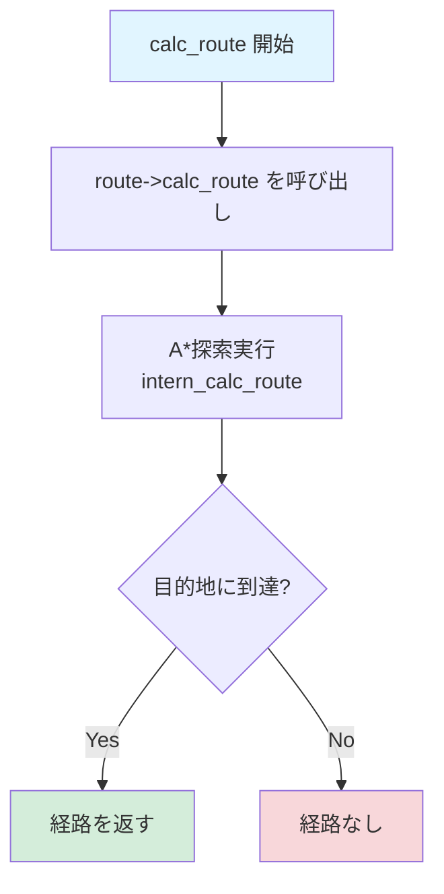

### コード

```cpp
bool vehicle_t::calc_route(koord3d start, koord3d ziel, sint32 max_speed, route_t* route)
{
    return route->calc_route(welt, start, ziel, this, max_speed, 0);
}
```

### 特徴

- 単純な A\* 探索のみ
- 特別な前処理・後処理なし
- `max_tile_len = 0`（停留所の長さチェックなし）

---

## 2. 道路車両（Road Vehicle）

**適用対象:** トラック、バス、自家用車

### 経路探索フロー

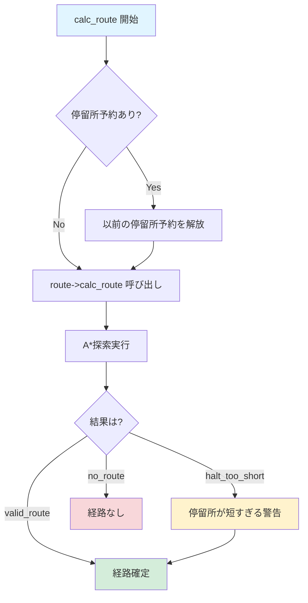

### 目的地判定（is_target）

道路車両は停留所の空き位置を探します。

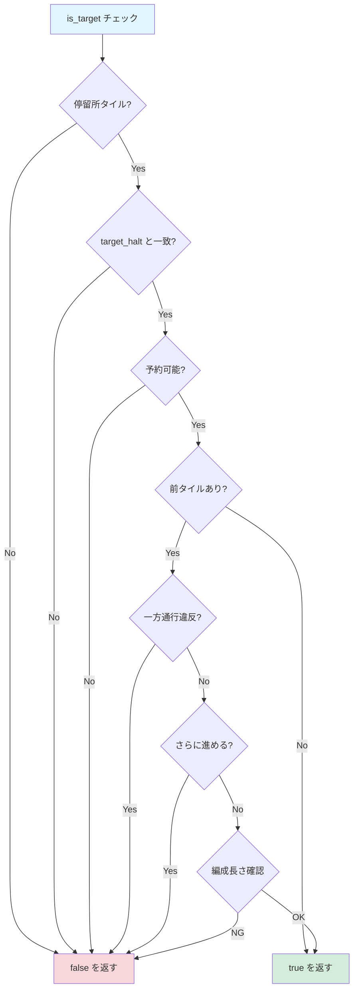

### コード

```cpp
bool road_vehicle_t::calc_route(koord3d start, koord3d ziel, sint32 max_speed, route_t* route)
{
    // 停留所予約を解放
    if(leading && previous_direction!=ribi_t::none && cnv && target_halt.is_bound()) {
        for(uint32 length=0; length<cnv->get_tile_length() && length+1<cnv->get_route()->get_count(); length++) {
            target_halt->unreserve_position(welt->lookup(cnv->get_route()->at(cnv->get_route()->get_count()-length-1)), cnv->self);
        }
    }
    target_halt = halthandle_t();

    // 経路探索（編成長も考慮）
    route_t::route_result_t r = route->calc_route(welt, start, ziel, this, max_speed, cnv->get_tile_length());

    // 停留所が短すぎる場合は警告
    if(r == route_t::valid_route_halt_too_short) {
        // メッセージを表示
    }
    return r;
}
```

### 特徴

- **停留所予約システム**: 停車位置を予約して衝突を防止
- **編成長チェック**: `cnv->get_tile_length()` で停留所の長さを確認
- **一方通行対応**: リビマスクで進行方向をチェック
- **警告メッセージ**: 停留所が短い場合にプレイヤーに通知

---

## 3. 鉄道車両（Rail Vehicle）

**適用対象:** 機関車、貨車、電車

### 経路探索フロー

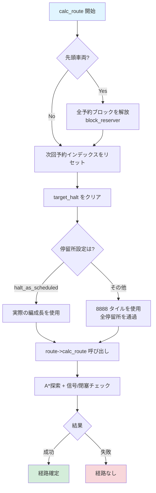

### 目的地判定（is_target）

鉄道車両は閉塞予約と編成長の両方をチェックします。

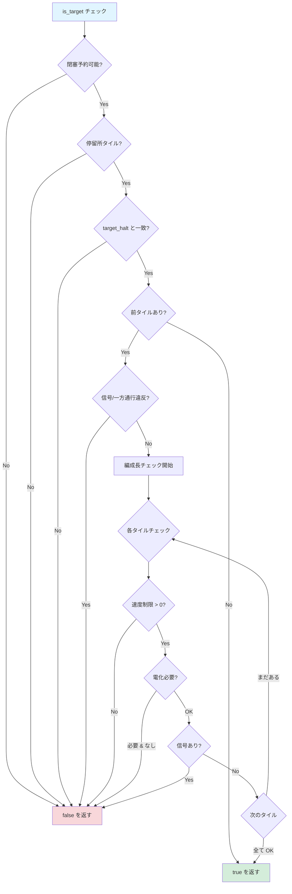

### コード

```cpp
bool rail_vehicle_t::calc_route(koord3d start, koord3d ziel, sint32 max_speed, route_t* route)
{
    if(leading && route_index < cnv->get_route()->get_count()) {
        // 全予約ブロックを解放
        route_t::index_t dummy;
        block_reserver(cnv->get_route(), cnv->back()->get_route_index(), dummy, dummy,
                       target_halt.is_bound() ? 100000 : 1, false, true);
    }
    cnv->set_next_reservation_index(0);
    target_halt = halthandle_t();

    // 編成長を決定（設定により異なる）
    const uint16 convoy_length = world()->get_settings().get_stop_halt_as_scheduled()
                                  ? cnv->get_tile_length() : 8888;

    return route->calc_route(welt, start, ziel, this, max_speed, convoy_length);
}
```

### 特徴

- **閉塞予約システム**: `block_reserver()` で線路区間を予約
- **信号対応**: 信号の状態を考慮した経路探索
- **電化チェック**: 電化が必要な車両は非電化区間を回避
- **編成長の柔軟な処理**: 設定により停留所全体を使うか実長で判定
- **予約の完全解放**: 経路計算前に既存の予約を全てクリア

---

## 4. 航空機（Air Vehicle）

**適用対象:** 飛行機、ヘリコプター

航空機の経路探索は**最も複雑**で、3 段階に分かれています。

### 経路探索フロー

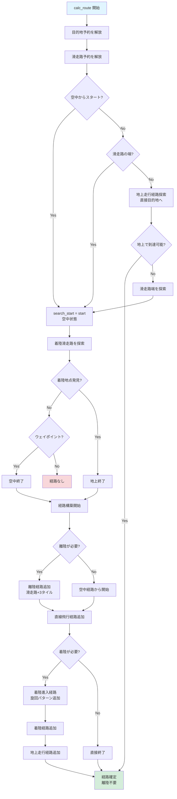

### 離陸・着陸の詳細フロー

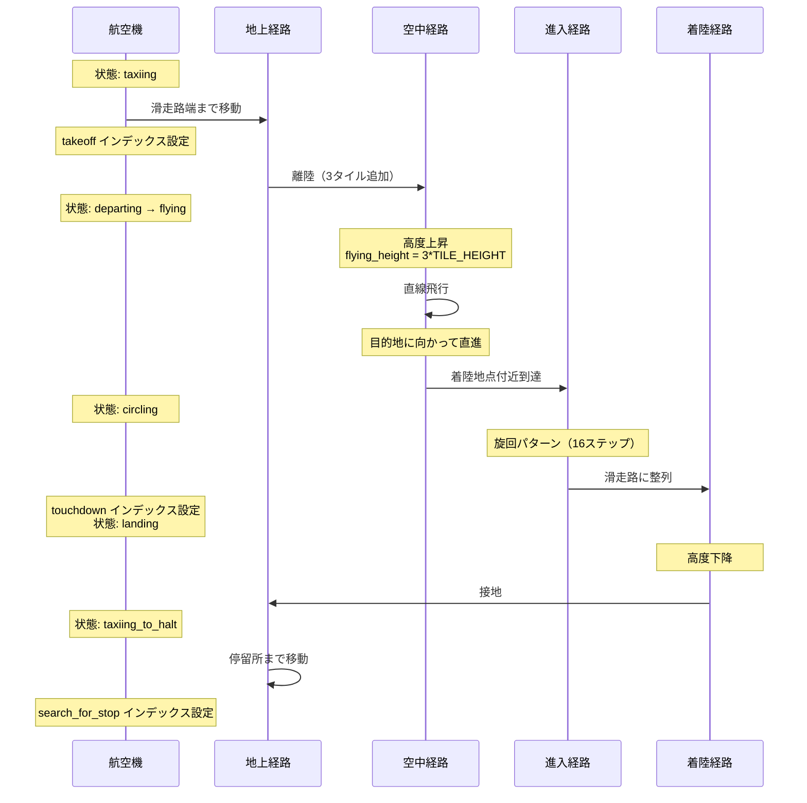

### 目的地判定（is_target）

航空機は状態によって判定ロジックが変わります。

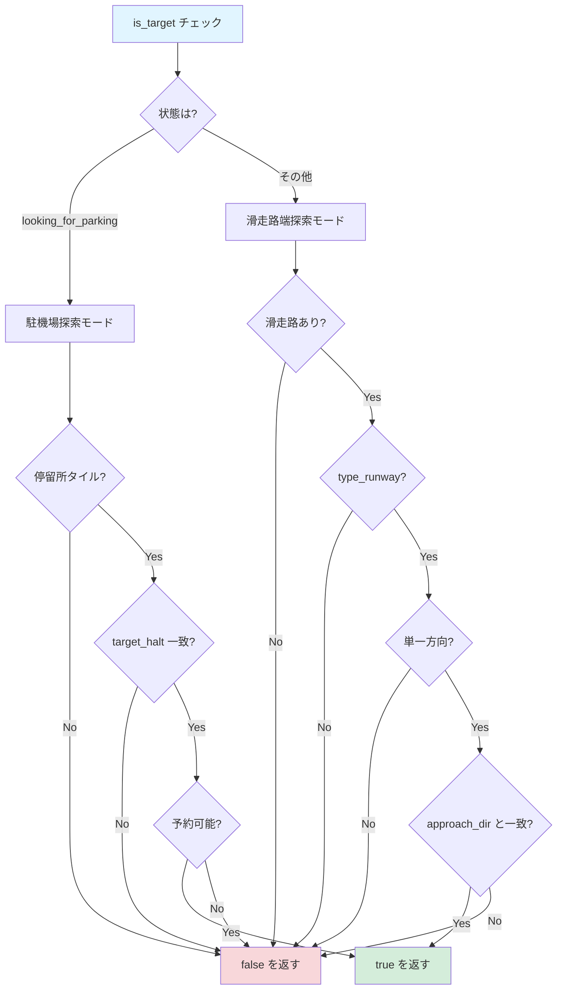

### コード（簡略版）

```cpp
bool air_vehicle_t::calc_route(koord3d start, koord3d ziel, sint32 max_speed, route_t* route)
{
    // 1. 予約解放
    if(leading && cnv) {
        // 停留所予約を解放
        // 滑走路予約を解放
    }

    // 2. 地上で直接到達可能かチェック
    if(!start_in_the_air) {
        state = taxiing;
        if(route->calc_route(welt, start, ziel, this, max_speed, 0)) {
            return true; // 地上経路で OK
        }
    }

    // 3. 離陸地点を探索
    if(!start_in_the_air) {
        state = taxiing;
        if(!route->find_route(welt, start, this, max_speed, ribi_t::all, 100)) {
            return false;
        }
        search_start = route->back();
    }

    // 4. 着陸地点を探索
    state = taxiing_to_halt;
    route_t end_route;
    if(!end_route.find_route(welt, ziel, this, max_speed, ribi_t::all, max_steps)) {
        // ウェイポイントの可能性
        end_in_air = true;
    }
    else {
        search_end = end_route.back();
    }

    // 5. 離陸経路を追加
    if(!start_in_the_air) {
        takeoff = route->get_count()-1;
        // 滑走路方向に3タイル追加
    }

    // 6. 直線飛行経路を追加
    route->append_straight_route(welt, landing_start);

    // 7. 着陸進入・旋回パターンを追加
    if(!end_in_air) {
        // 16ステップの旋回パターン
        touchdown = route->get_count()+2;
    }

    // 8. 地上走行経路を追加
    search_for_stop = route->get_count()-1;

    return true;
}
```

### 特徴

- **3 段階経路**: 地上走行 → 空中飛行 → 着陸進入
- **状態遷移**: `taxiing`, `departing`, `flying`, `landing`, `circling`, `taxiing_to_halt`, `looking_for_parking`
- **旋回パターン**: 16 ステップの円形進入経路
- **高度管理**: `flying_height` と `target_height` で高度を制御
- **ウェイポイント対応**: 空中で終了する経路も可能
- **滑走路予約**: 離着陸時の滑走路ブロック管理

---

## 5. 船舶（Water Vehicle）

**適用対象:** 貨物船、旅客船、フェリー

### 経路探索フロー

船舶は**基本車両と同じロジック**を使用しますが、以下の点が特殊です：

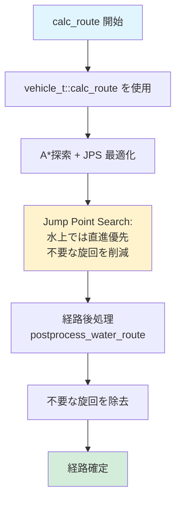

### 水路特有の処理

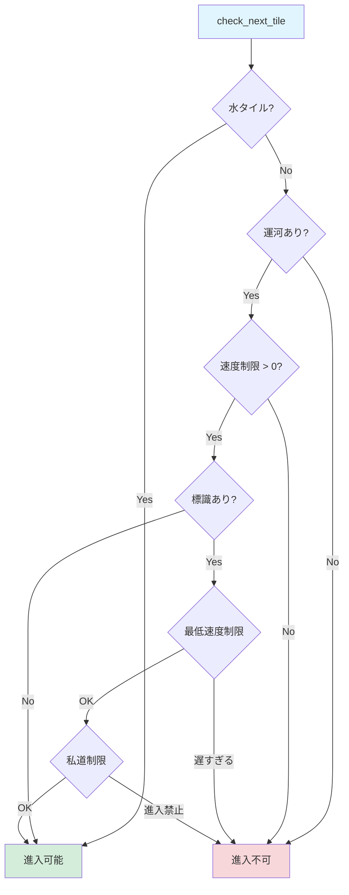

### コード

```cpp
bool water_vehicle_t::check_next_tile(const grund_t *bd) const
{
    if(bd->is_water()) {
        return true; // 水タイルは常に OK
    }

    // 運河の場合は追加チェック
    const weg_t *w = bd->get_weg(water_wt);

#ifdef ENABLE_WATERWAY_SIGNS
    if(w && w->has_sign()) {
        const roadsign_t* rs = bd->find<roadsign_t>();
        if(rs->get_desc()->get_wtyp() == get_waytype()) {
            // 最低速度チェック
            if(cnv != NULL && rs->get_desc()->get_min_speed() > 0
               && rs->get_desc()->get_min_speed() > cnv->get_min_top_speed()) {
                return false;
            }
            // 私道チェック
            if(rs->get_desc()->is_private_way()
               && (rs->get_player_mask() & (1<<get_player_nr())) == 0) {
                return false;
            }
        }
    }
#endif

    return (w && w->get_max_speed() > 0);
}
```

### 特徴

- **JPS（Jump Point Search）最適化**: 水上経路で直進を優先
- **水タイルと運河**: 水タイルは自由、運河は道路と同様の制約
- **経路後処理**: 不要な旋回を自動的に削除
- **標識対応**: 運河では速度制限や私道設定に対応
- **摩擦係数**: 水門（勾配）では摩擦 16、通常は 1

---

## 共通の経路探索アルゴリズム（A\*探索）

すべての車両タイプは最終的に `route_t::intern_calc_route()` を使用します。

### A\*探索の流れ

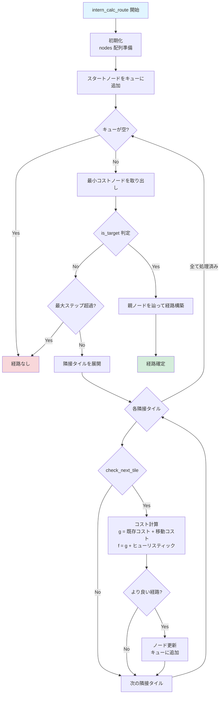

### コスト計算

```cpp
// 移動コスト = 基本コスト + 上り坂コスト + カーブコスト
cost = base_cost;

// 上り坂は追加コスト
if (slope_upward) {
    cost += cost_upslope;
}

// カーブ（方向転換）も追加コスト
if (direction_changed) {
    cost += curve_cost;
}

// ヒューリスティック = マンハッタン距離
heuristic = abs(current.x - target.x) + abs(current.y - target.y);

// 総コスト
f = cost + heuristic;
```

---

## まとめ

### 車両タイプ別の特徴一覧

| 車両タイプ   | 経路探索の特徴                   | 特殊処理                           |
| ------------ | -------------------------------- | ---------------------------------- |
| **基本車両** | 単純な A\*探索                   | なし                               |
| **道路車両** | 停留所予約 + 編成長チェック      | 一方通行対応、追い越し             |
| **鉄道車両** | 閉塞予約 + 信号制御              | 電化チェック、長距離停車           |
| **航空機**   | 3 段階経路（地上 → 空中 → 着陸） | 滑走路管理、旋回パターン、高度制御 |
| **船舶**     | JPS 最適化 + 水路判定            | 水門処理、経路後処理               |

### 経路探索のカスタマイズポイント

各車両タイプは以下のメソッドで挙動をカスタマイズします：

1. **`calc_route()`**: 予約管理、経路長、特殊経路構築
2. **`is_target()`**: 目的地到達条件（編成長、予約状況、状態など）
3. **`check_next_tile()`**: 進入可能性（電化、一方通行、速度制限など）
4. **`get_cost_upslope()`**: 上り坂コスト（車両性能による）
5. **`get_ribi()`**: 進行可能方向（一方通行、信号など）

これらのメソッドを適切に実装することで、各車両タイプに適した経路探索が実現されます。
