# Simutrans 主要機能リファレンス

Simutrans の個々の主要機能について、実装の詳細と設計思想を解説します。

## 📋 機能カテゴリ一覧

### 🚉 輸送システム

- [停留所（Halt）システム](#1-停留所haltシステム)
- [路線（Line）管理](#2-路線line管理システム)
- [編成（Convoi）システム](#3-編成convoiシステム)
- [スケジュール管理](#4-スケジュール管理)

### 🏭 経済システム

- [工場（Factory）システム](#5-工場factoryシステム)
- [貨物（Ware）流通](#6-貨物ware流通システム)
- [プレイヤー財務](#7-プレイヤー財務システム)

### 🌍 世界システム

- [都市（Stadt）システム](#8-都市stadtシステム)
- [地形・マップ管理](#9-地形マップ管理)
- [時間・同期システム](#10-時間同期システム)

### 🛠️ インフラ

- [道路・線路建設](#11-道路線路建設システム)
- [信号・標識システム](#12-信号標識システム)
- [Depot（車庫）管理](#13-depot車庫管理)

---

## 1. 停留所（Halt）システム

**ファイル:** [src/simutrans/simhalt.h](../../src/simutrans/simhalt.h), [simhalt.cc](../../src/simutrans/simhalt.cc)

### 概要

停留所（`haltestelle_t`）は、Simutrans における貨物・旅客の積み下ろし拠点です。複数のタイルにまたがる停留所を統合管理し、経路探索、貨物配送、統計管理を行います。

### 主要機能

#### 1.1 停留所タイプ

```cpp
enum stationtyp {
    invalid         = 0,
    loadingbay      = 1 << 0,  // トラック荷台
    railstation     = 1 << 1,  // 鉄道駅
    dock            = 1 << 2,  // 港
    busstop         = 1 << 3,  // バス停
    airstop         = 1 << 4,  // 空港
    monorailstop    = 1 << 5,  // モノレール駅
    tramstop        = 1 << 6,  // 路面電車停留所
    maglevstop      = 1 << 7,  // リニア駅
    narrowgaugestop = 1 << 8   // 狭軌鉄道駅
};
```

複数のタイプを組み合わせて（OR 演算）、複合停留所を作成可能です。

#### 1.2 貨物種別の有効化

```cpp
enum station_flags {
    NOT_ENABLED = 0,
    PAX         = 1 << 0,  // 旅客
    POST        = 1 << 1,  // 郵便
    WARE        = 1 << 2   // 貨物
};
```

各停留所は、受け入れる貨物種別を設定できます。

#### 1.3 統計項目

```cpp
#define HALT_ARRIVED         0  // 到着した貨物量
#define HALT_DEPARTED        1  // 出発した貨物量
#define HALT_WAITING         2  // 待機中の貨物量
#define HALT_HAPPY           3  // 満足した旅客数
#define HALT_UNHAPPY         4  // 不満足な旅客数
#define HALT_NOROUTE         5  // 経路なし旅客数
#define HALT_CONVOIS_ARRIVED 6  // 到着した編成数
#define HALT_WALKED          7  // 徒歩で移動した数
```

12 ヶ月分の履歴を保持し、グラフ表示に使用されます。

### アーキテクチャ

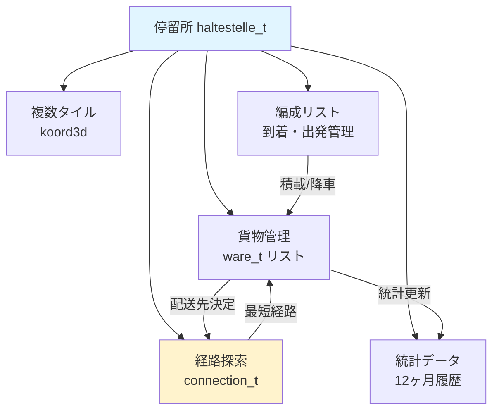

### 主要メソッド

#### 貨物管理

```cpp
// 貨物を追加
void add_ware(ware_t ware);

// 貨物を取得（編成への積載）
uint32 fetch_goods(convoihandle_t cnv, slist_tpl<ware_t>& load,
                   const goods_desc_t* good, uint32 amount);

// 待機中の貨物総量
uint32 get_ware_summe(const goods_desc_t* good) const;
```

#### 経路探索

```cpp
// 目的地までの経路を検索
halthandle_t get_halt(const koord &pos, const player_t *player) const;

// 接続情報を更新
void rebuild_destinations();
```

#### 統計

```cpp
// 統計値を記録
void book(sint64 amount, int cost_type);

// 統計値を取得
sint64 get_finance_history(int month, int cost_type) const;
```

### 設計のポイント

1. **分散配置**: 停留所は複数タイルに配置可能で、自動的に統合されます
2. **接続キャッシュ**: 頻繁な経路探索を避けるため、接続情報をキャッシュします
3. **非同期更新**: 経路情報の更新は段階的に行い、パフォーマンスを維持します
4. **予約システム**: 車両が停車位置を予約し、衝突を防ぎます

---

## 2. 路線（Line）管理システム

**ファイル:** [src/simutrans/simline.h](../../src/simutrans/simline.h), [simline.cc](../../src/simutrans/simline.cc)

### 概要

路線（`simline_t`）は、複数の編成を統合管理するシステムです。スケジュールを共有し、統計を集計します。

### 路線タイプ

```cpp
enum linetype {
    line            = 0,  // 汎用
    truckline       = 1,  // トラック
    trainline       = 2,  // 鉄道
    shipline        = 3,  // 船舶
    airline         = 4,  // 航空
    monorailline    = 5,  // モノレール
    tramline        = 6,  // 路面電車
    maglevline      = 7,  // リニア
    narrowgaugeline = 8,  // 狭軌鉄道
    MAX_LINE_TYPE
};
```

### 財務統計

```cpp
#define LINE_CAPACITY          0  // 輸送可能量
#define LINE_TRANSPORTED_GOODS 1  // 輸送済み量
#define LINE_CONVOIS           2  // 編成数
#define LINE_REVENUE           3  // 収入
#define LINE_OPERATIONS        4  // 運用コスト
#define LINE_PROFIT            5  // 利益
#define LINE_DISTANCE          6  // 走行距離
#define LINE_MAXSPEED          7  // 最高速度
#define LINE_WAYTOLL           8  // 通行料
```

### 状態管理

路線の状態は色で表現されます：

- **黒（BLACK）**: 正常
- **白（WHITE）**: 編成なし
- **黄（YELLOW）**: 車両が動いていない
- **赤（RED）**: 先月赤字
- **青（BLUE）**: 旧式車両あり

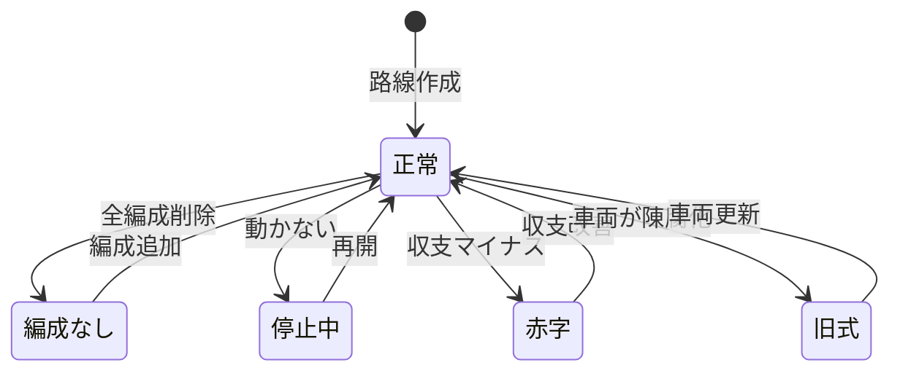

### 主要メソッド

```cpp
// 編成を路線に追加
void add_convoy(convoihandle_t cnv);

// 編成を路線から削除
void remove_convoy(convoihandle_t cnv);

// スケジュールを設定
void set_schedule(schedule_t* schedule);

// 財務統計を記録
void book(sint64 amount, int cost_type);
```

### 設計のポイント

1. **共有スケジュール**: 複数編成が同じスケジュールを共有し、メモリ効率が向上
2. **集計統計**: 路線全体の統計を自動集計し、経営判断を支援
3. **状態の可視化**: 路線の問題を色で即座に把握可能
4. **撤退モード**: `withdraw` フラグで段階的な路線廃止が可能

---

## 3. 編成（Convoi）システム

**ファイル:** [src/simutrans/simconvoi.h](../../src/simutrans/simconvoi.h), [simconvoi.cc](../../src/simutrans/simconvoi.cc)

### 概要

編成（`convoi_t`）は、複数の車両を連結した輸送単位です。経路探索、加速計算、貨物管理を統合的に行います。

### 編成状態

```cpp
enum states {
    INITIAL,              // 初期状態（車庫内）
    EDIT_SCHEDULE,        // スケジュール編集中
    ROUTING_1,            // 経路探索中
    DUMMY4, DUMMY5,
    NO_ROUTE,             // 経路なし
    CAN_START,            // 出発可能
    CAN_START_ONE_MONTH,  // 1ヶ月後出発可能
    CAN_START_TWO_MONTHS, // 2ヶ月後出発可能
    ENTERING_DEPOT,       // 車庫進入中
    LEAVING_DEPOT,        // 車庫退出中
    DRIVING,              // 運行中
    LOADING,              // 積載中
    WAITING_FOR_CLEARANCE,// 信号待ち
    WAITING_FOR_CLEARANCE_ONE_MONTH,
    WAITING_FOR_CLEARANCE_TWO_MONTHS
};
```

### 編成の構成

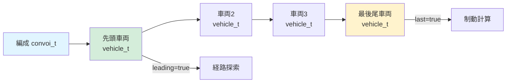

### 物理シミュレーション

#### 加速計算

```cpp
void calc_acceleration(uint32 delta_t);
```

以下の要素を考慮します：

- **総重量**: `sum_gesamtweight`（自重 + 積載）
- **摩擦重量**: `sum_friction_weight`（カーブ・勾配による変動）
- **総出力**: `sum_gear_and_power`（ギア補正込み）
- **速度制限**: 線路・信号・カーブによる制約

#### 終端速度計算

```cpp
sint32 calc_max_speed(uint64 total_power, uint64 total_weight, sint32 speed_limit);
```

残余パワー式を使用（詳細は [VEHICLE_TERMINAL_SPEED.md](VEHICLE_TERMINAL_SPEED.md) 参照）

### 主要メソッド

#### 経路管理

```cpp
// 新しい経路を探索
void suche_neue_route();

// スケジュールに従って次の目的地へ
void ziel_erreicht();
```

#### 貨物管理

```cpp
// 停留所で貨物を積載
void laden();

// 貨物を降ろす
void unload_freight();
```

#### 財務

```cpp
// 収入を記録
void book(sint64 amount, int cost_type);

// 運用コストを計算
sint64 calc_running_cost() const;
```

### 設計のポイント

1. **先頭車両の責任**: 経路探索やブロック予約は先頭車両が担当
2. **物理シミュレーション**: 現実的な加速・制動を再現
3. **非同期処理**: 経路探索は非同期で実行し、ゲームループをブロックしない
4. **状態機械**: 明確な状態遷移で複雑な動作を管理

---

## 4. スケジュール管理

**ファイル:** [src/simutrans/dataobj/schedule.h](../../src/simutrans/dataobj/schedule.h), [schedule.cc](../../src/simutrans/dataobj/schedule.cc)

### 概要

スケジュール（`schedule_t`）は、編成の巡回経路を定義します。各エントリーは目的地座標と待機条件を含みます。

### スケジュールエントリー

```cpp
struct schedule_entry_t {
    koord3d pos;           // 目的地座標
    uint8 waiting;         // 待機条件フラグ
    sint16 minimum_loading; // 最小積載率（%）
};
```

### 待機条件フラグ

```cpp
#define WAIT_FOR_TIME      1  // 指定時刻まで待機
#define WAIT_FOR_LOAD     16  // 積載完了まで待機
#define NO_LOAD           32  // 積載しない
```

### スケジュールタイプ

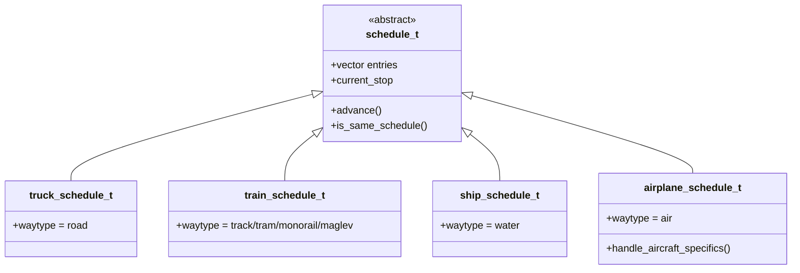

### 実行フロー

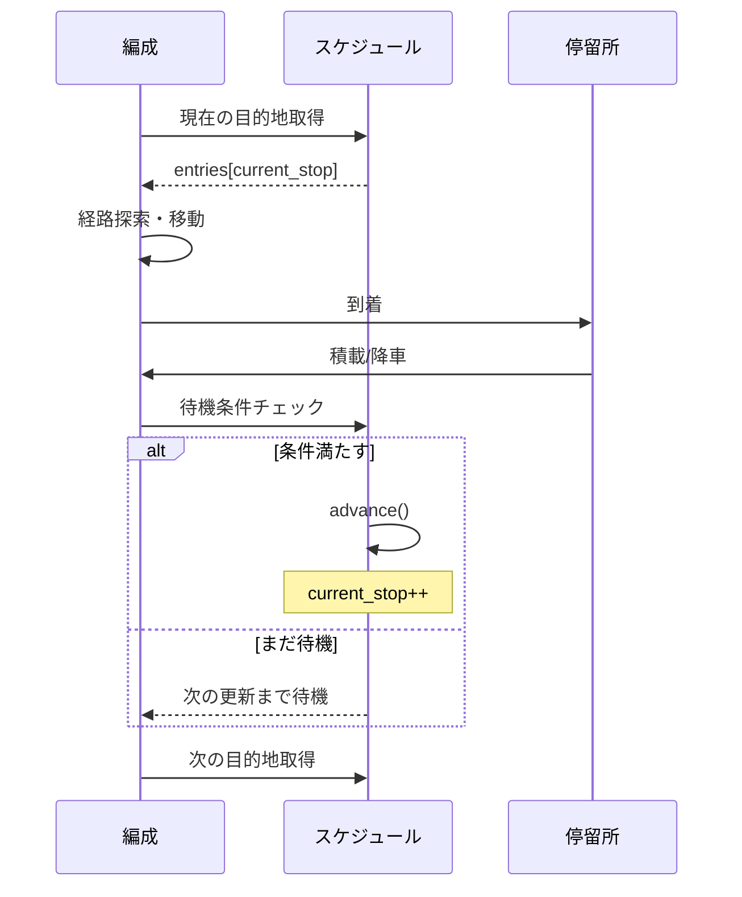

### 設計のポイント

1. **循環構造**: スケジュールは循環リストで、最後のエントリーから最初に戻る
2. **柔軟な待機条件**: 時刻・積載率・通過など多様な条件設定
3. **路線との共有**: 同じスケジュールを複数編成で共有可能
4. **動的更新**: 運行中でもスケジュール変更可能（次の停留所から反映）

---

## 5. 工場（Factory）システム

**ファイル:** [src/simutrans/simfab.h](../../src/simutrans/simfab.h), [simfab.cc](../../src/simutrans/simfab.cc)

### 概要

工場（`fabrik_t`）は、原材料を消費して製品を生産する施設です。サプライチェーンを形成し、経済システムの中核を担います。

### 生産方式

#### Just-In-Time 2 (JIT2)

最新の生産システムで、以下の特徴があります：

- **在庫ベースの生産**: 在庫が一定量を超えると生産速度が低下
- **電力ブースト**: 電力供給で生産性向上
- **旅客ブースト**: 労働者の通勤で生産性向上
- **郵便ブースト**: 郵便配達で生産性向上

```cpp
// ブースト定数
#define FAB_BOOST_ELECTRIC  2  // 電力ブースト
#define FAB_BOOST_PAX       3  // 旅客ブースト
#define FAB_BOOST_MAIL      4  // 郵便ブースト
```

### 生産サイクル

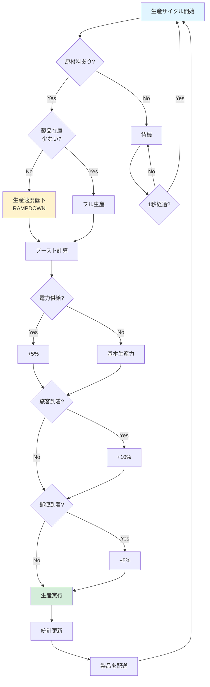

### 工場統計

```cpp
#define FAB_PRODUCTION      0   // 生産量
#define FAB_POWER           1   // 電力消費
#define FAB_BOOST_ELECTRIC  2   // 電力ブースト
#define FAB_BOOST_PAX       3   // 旅客ブースト
#define FAB_BOOST_MAIL      4   // 郵便ブースト
#define FAB_PAX_GENERATED   5   // 発生した旅客
#define FAB_PAX_DEPARTED    6   // 出発した旅客
#define FAB_PAX_ARRIVED     7   // 到着した旅客
#define FAB_MAIL_GENERATED  8   // 発生した郵便
#define FAB_MAIL_DEPARTED   9   // 出発した郵便
#define FAB_MAIL_ARRIVED   10   // 到着した郵便
```

### サプライチェーン

```mermaid
graph LR
    Mine[鉱山<br/>Factory] -->|鉄鉱石| Steel[製鉄所<br/>Factory]
    Coal[炭鉱<br/>Factory] -->|石炭| Steel
    Steel -->|鋼鉄| Car[自動車工場<br/>Factory]
    Car -->|自動車| City[都市<br/>Stadt]

    Forest[森林<br/>Factory] -->|木材| Sawmill[製材所<br/>Factory]
    Sawmill -->|木材| Furniture[家具工場<br/>Factory]
    Furniture -->|家具| City

    style Mine fill:#8B4513
    style Coal fill:#2F4F4F
    style Steel fill:#708090
    style Car fill:#4682B4
    style City fill:#FFD700
```

### 主要メソッド

```cpp
// 生産を実行
void step(uint32 delta_t);

// 原材料を受け取る
void liefere_an(const goods_desc_t* ware, uint32 amount);

// 製品を配送
void distribute_goods(uint32 product_index);

// ブーストを更新
void update_boosts();
```

### 設計のポイント

1. **動的生産**: 需要と供給に応じて生産速度が変化
2. **ブーストシステム**: 電力・旅客・郵便で生産性向上
3. **在庫管理**: 過剰在庫を避けるランプダウン機構
4. **経済連鎖**: 複数工場が連鎖してサプライチェーンを形成

---

## 6. 貨物（Ware）流通システム

**ファイル:** [src/simutrans/simware.h](../../src/simutrans/simware.h), [simware.cc](../../src/simutrans/simware.cc)

### 概要

貨物（`ware_t`）は、輸送される品物の単位です。出発地・目的地・経由地の情報を持ち、経路に沿って移動します。

### 貨物構造

```cpp
class ware_t {
    goods_desc_t* desc;      // 貨物種別
    uint32 amount;            // 数量
    koord target_pos;         // 最終目的地
    koord via_pos;            // 経由地（トランスファー）
    halthandle_t target_halt; // 目的停留所
    halthandle_t via_halt;    // 経由停留所
    uint32 arrival_time;      // 到着予定時刻
};
```

### 貨物カテゴリ

貨物は以下のカテゴリに分類されます：

```cpp
enum goods_catg {
    INDEX_PAS  = 0,  // 旅客（Passengers）
    INDEX_MAIL = 1,  // 郵便（Mail）
    INDEX_NONE = 2,  // 貨物なし
    INDEX_GOODS = 3  // 一般貨物（以降）
};
```

### 経路決定フロー

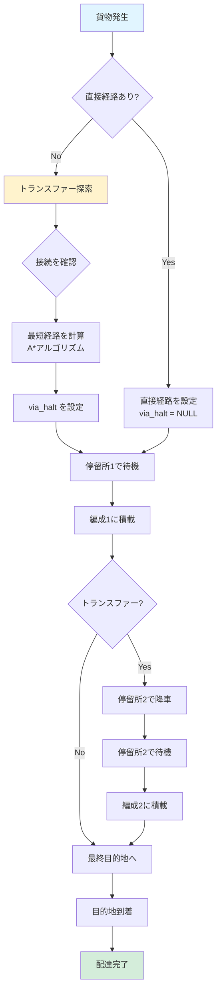

### トランスファー（乗り換え）

複数の路線を経由して目的地に到達する仕組みです。

**例: 鉱山 → 製鉄所への輸送**


### 待ち時間と不満

旅客は待ち時間に応じて不満を持ちます：

```cpp
// 待ち時間の閾値
#define HAPPY_THRESHOLD    2000  // この時間以内なら満足
#define UNHAPPY_THRESHOLD  5000  // これを超えると不満
```

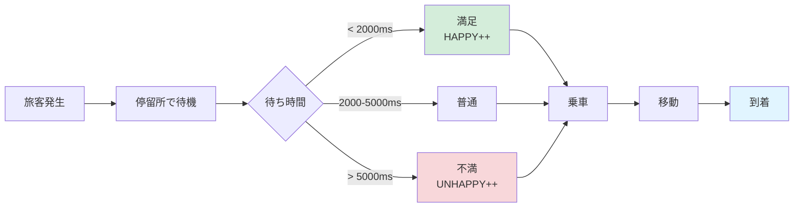

### 主要メソッド

```cpp
// 目的地を設定
void set_target(koord target_pos);

// 経由地を設定（トランスファー）
void set_via(koord via_pos);

// 到着時刻を記録
void set_arrival_time(uint32 time);

// 貨物を統合（同じ目的地の貨物をまとめる）
void merge(const ware_t &w);
```

### 設計のポイント

1. **トランスファー**: 複雑な輸送網を構築可能
2. **遅延追跡**: 到着時刻を記録し、遅延を可視化
3. **貨物統合**: 同じ目的地の貨物をまとめてメモリ効率化
4. **旅客満足度**: 待ち時間ベースのフィードバック

---

## 7. プレイヤー財務システム

**ファイル:** [src/simutrans/player/simplay.h](../../src/simutrans/player/simplay.h), [finance.h](../../src/simutrans/player/finance.h)

### 概要

各プレイヤーは独立した財務システムを持ち、収入・支出・資産を管理します。

### 財務項目

```cpp
enum finance_t {
    COST_CONSTRUCTION,    // 建設費
    COST_VEHICLE_RUN,     // 車両運用費
    COST_NEW_VEHICLE,     // 車両購入費
    COST_INCOME,          // 収入
    COST_MAINTENANCE,     // 維持費
    COST_ASSETS,          // 資産
    COST_CASH,            // 現金
    COST_NETWEALTH,       // 純資産
    COST_PROFIT,          // 利益
    COST_OPERATING_PROFIT,// 営業利益
    COST_MARGIN,          // 利益率
    COST_TRANSPORTED_GOODS,// 輸送量
    COST_POWERLINES,      // 電線費用
    COST_WAY_TOLLS,       // 通行料
    MAX_PLAYER_COST_BUTTON
};
```

### 財務フロー

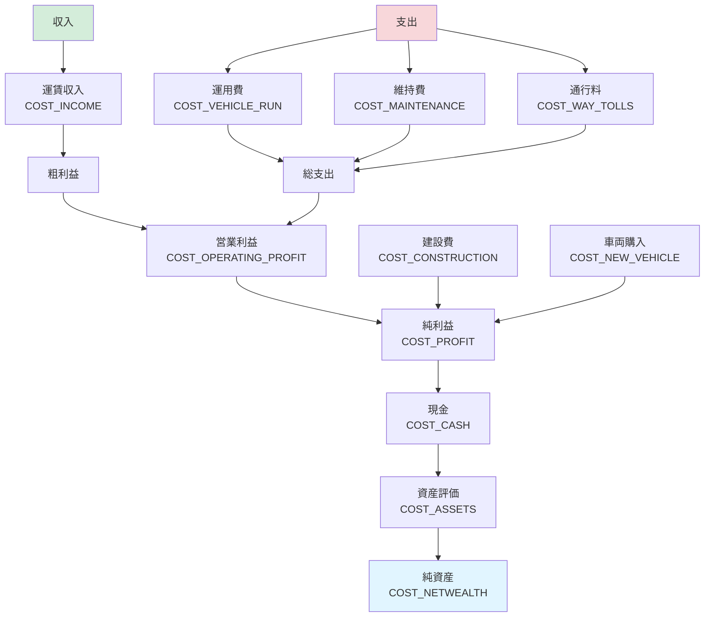

### 月次決算

毎月、以下の処理が実行されます：

```cpp
void new_month() {
    // 1. 先月の統計を保存
    roll_finance_history_month();

    // 2. 維持費を計算
    calc_maintenance();

    // 3. 利益率を計算
    calc_margin();

    // 4. 資産評価を更新
    update_assets();

    // 5. AIの場合、戦略を再評価
    if(is_ai()) {
        ai->new_month();
    }
}
```

### 倒産システム

現金がマイナスになると警告が出ます：

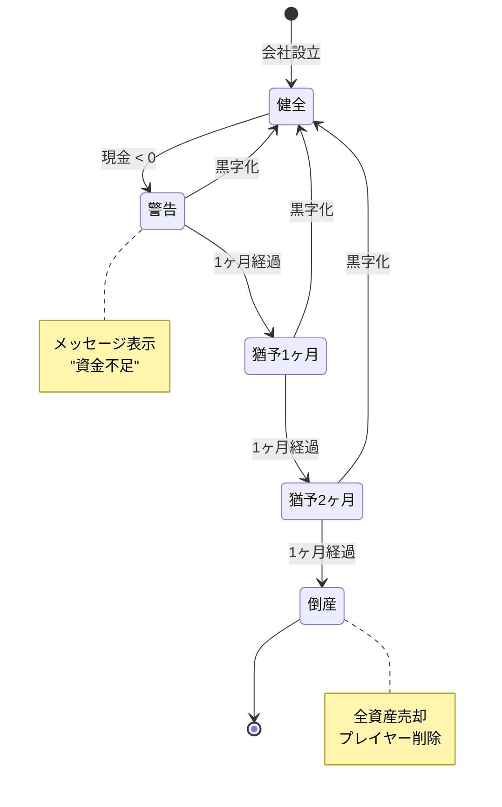

### 主要メソッド

```cpp
// 財務統計を記録
void book_stat(sint64 amount, finance_t type);

// 維持費を計算
sint64 calc_maintenance() const;

// 資産評価
sint64 calc_assets() const;

// 倒産チェック
bool check_bankrupt() const;
```

### 設計のポイント

1. **履歴管理**: 12 ヶ月分の履歴を保持し、グラフ表示
2. **自動計算**: 利益率・純資産は自動計算
3. **猶予期間**: 即座に倒産せず、3 ヶ月の猶予
4. **AI 統合**: AI プレイヤーも同じ財務システムを使用

---

## 8. 都市（Stadt）システム

**ファイル:** [src/simutrans/world/simcity.h](../../src/simutrans/world/simcity.h), [simcity.cc](../../src/simutrans/world/simcity.cc)

### 概要

都市（`stadt_t`）は、建物を配置し、旅客・郵便を発生させ、成長するシステムです。

### 都市成長メカニズム

都市は以下の条件で成長します：

1. **旅客輸送**: 都市間の旅客輸送が活発
2. **郵便配達**: 郵便が配達される
3. **電力供給**: 電力が供給されている（オプション）
4. **道路接続**: 他の都市との道路接続

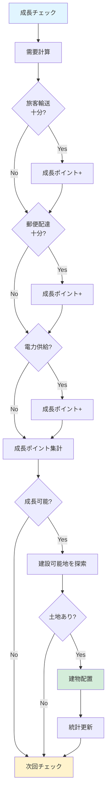

### 建物タイプ

```cpp
enum building_types {
    residential,  // 住宅
    commercial,   // 商業
    industrial    // 工業
};
```

各建物は旅客・郵便・貨物を発生させます。

### 旅客・郵便生成

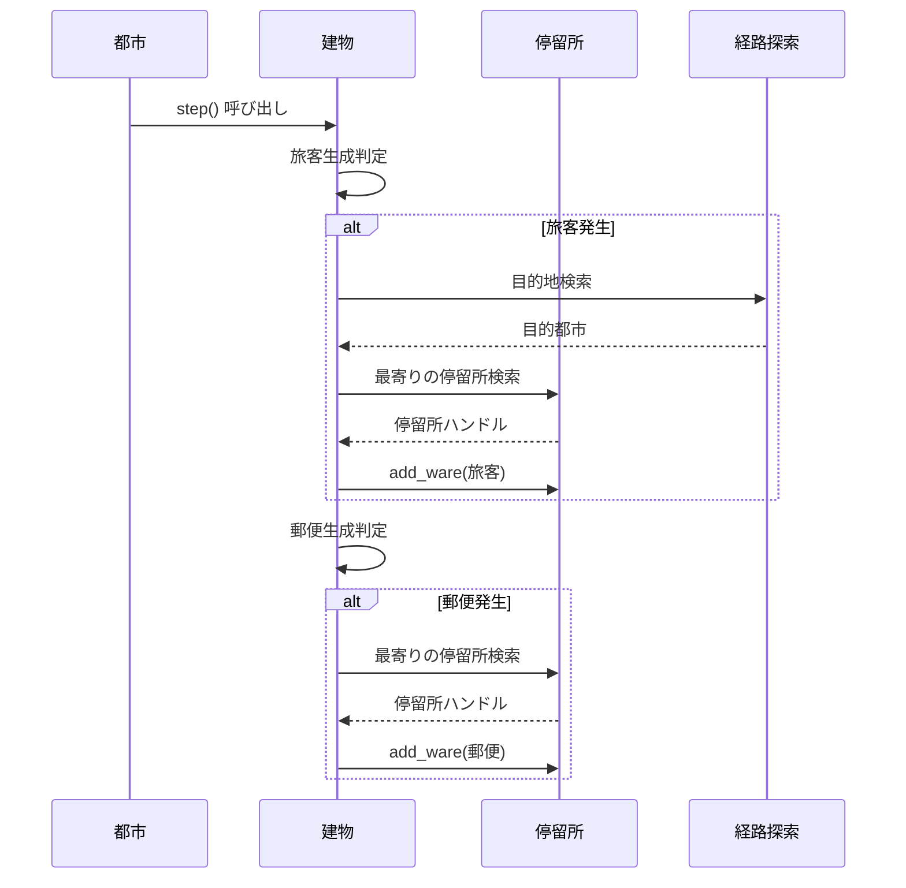

### 主要メソッド

```cpp
// 都市の更新（毎ステップ）
void step(uint32 delta_t);

// 成長チェック（毎月）
void new_month();

// 建物を配置
bool build_city_building(koord pos);

// 旅客需要を計算
uint32 get_passenger_demand() const;
```

### 設計のポイント

1. **需要駆動成長**: 輸送サービスの質が成長に直結
2. **有機的拡大**: 道路に沿って自然に拡大
3. **建物多様性**: 住宅・商業・工業のバランス
4. **統計追跡**: 人口・建物数・旅客数を記録

---

## まとめ

Simutrans の主要機能は、以下のように相互に連携しています：

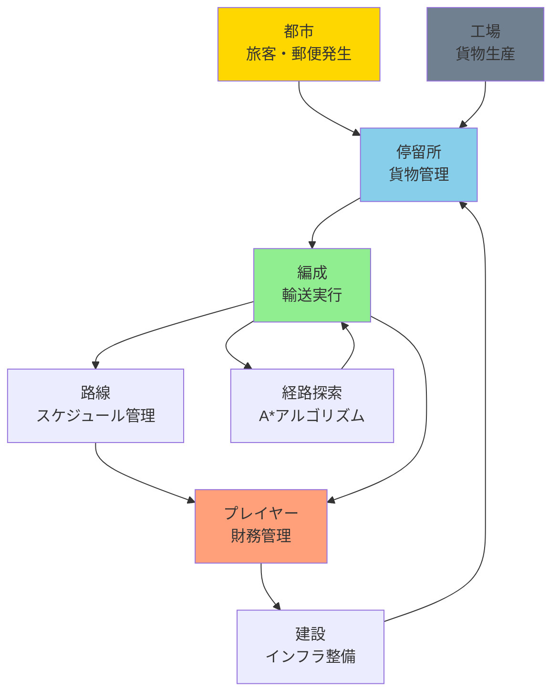

各システムは独立性を保ちつつ、明確なインターフェースで連携しています。この設計により、拡張性と保守性が確保されています。
